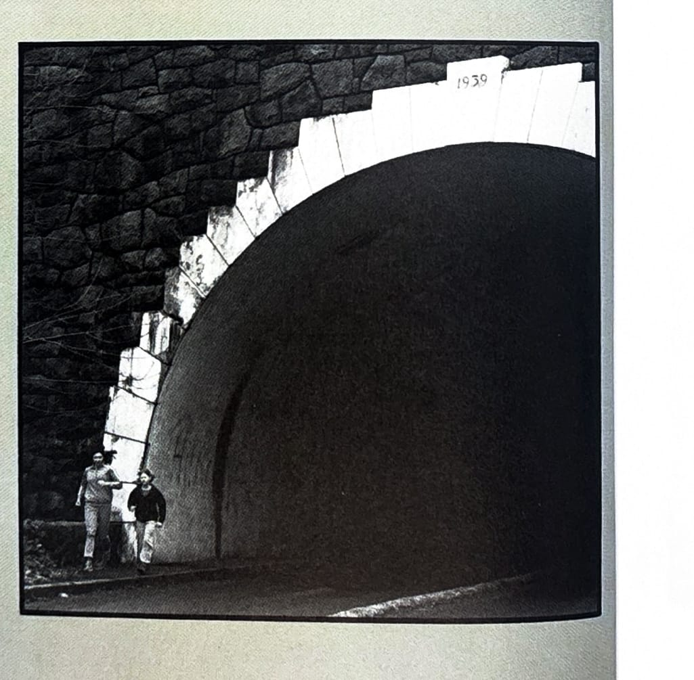

import RouteStats from "@/components/blog/RouteStats.astro";

<RouteStats
	routeNumber={frontmatter.routeNumber}
	section={frontmatter.section}
	distanceMiles={frontmatter.distanceMiles}
	distanceKm={frontmatter.distanceKm}
	difficulty={frontmatter.difficulty}
	beginningPoint={frontmatter.beginningPoint}
	runningSurface={frontmatter.runningSurface}
	suggestedBy={frontmatter.suggestedBy}
	conditions={frontmatter.routeConditions}
/>

<blockquote>

This running route is a "sleeper" &ndash; relatively unused by runners, yet offering one of the most picturesque vistas on the entire east side of the city. The run starts and ends on the top of Rocky Butte, so get ready to excercise your quadriceps and lungs for the 300 foot haul from the base back to the summit.

To get to Rocky Butte, use the approach from N.E. 92nd Avenue or the Fremont approach from 82nd Avenue and follow the signs to the top. Once you're on Rocky Butte Road, you'll get there. If you pass the infamous county jail on the east side, go back because you're going the wrong way.

Head out of the parking lot via the road on the west side (facing the city) and follow the road to the bottom of the hill. Turn right on Academy Avenue at the intersection and stay on Academy as it winds around the north side of the Butte past Judson Baptist College (the old Hill Military Academy). Traverse the east slopes above the county jail back to the parking lot on the summit.

Rock climbers often are around the walls on the summit practicing their skills.

There is no water or restrooms.

</blockquote>

_Photograph by Ancil Nance, from the original book._

