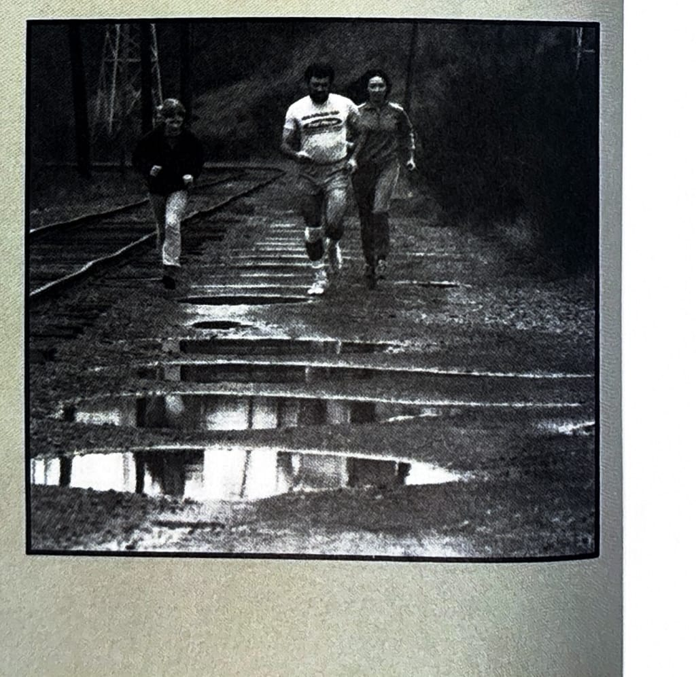

import RouteStats from "@/components/blog/RouteStats.astro";

<RouteStats
	routeNumber={frontmatter.routeNumber}
	section={frontmatter.section}
	distanceMiles={frontmatter.distanceMiles}
	distanceKm={frontmatter.distanceKm}
	difficulty={frontmatter.difficulty}
	beginningPoint={frontmatter.beginningPoint}
	runningSurface={frontmatter.runningSurface}
	suggestedBy={frontmatter.suggestedBy}
	conditions={frontmatter.routeConditions}
/>

<blockquote>

Would you believe it is possible to run through a wildlife sanctuary in a pristine-like setting along the Willamette River in the heart of the city? Before you scoff, try this lovely gem. Do the lower loop 2 or 3 times if you feel energetic, and stay around for a picnic and gay nineties type afternoon with the kids in Oaks Amusement Park.

If your are coming from the west side cross the Sellwood Bridge, go east two blocks and turn left on SE 7th Ave. Drive to Malden Street and park in the Sellwood Park parking lot. Directly west of the parking lot is a cement light pole with a wooden bench beside it. Run to that point, and you'll see the trail dipping suddenly down the cliff at a leftward angle and switchbacking to the swampland below.

Follow the trail to the right going around the Oaks-Pioneer Park, part of the city's Sellwood Park system. Keep following the toe of the slope next to Oaks Bottom Park, a recently established wildlife sanctuary administered by the city in a unique collaboration with the local chapter of the Audubon Society. Take the left fork in the trail and run south along the railroad tracks with good views of the river. Look for the trail that slants up the hill alongside Sellwood Park. Follow it back to the starting point.

</blockquote>

_Photograph by Ancil Nance, from the original book._

