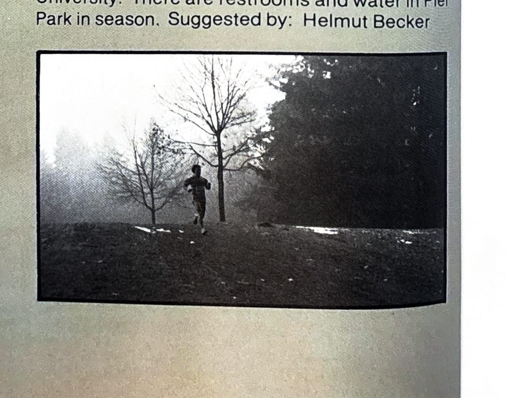

import RouteStats from "@/components/blog/RouteStats.astro";

<RouteStats
	routeNumber={frontmatter.routeNumber}
	section={frontmatter.section}
	distanceMiles={frontmatter.distanceMiles}
	distanceKm={frontmatter.distanceKm}
	difficulty={frontmatter.difficulty}
	beginningPoint={frontmatter.beginningPoint}
	runningSurface={frontmatter.runningSurface}
	suggestedBy={frontmatter.suggestedBy}
	conditions={frontmatter.routeConditions}
/>

<blockquote>

This loop will offer some surprises for runners unfamiliar with North Portland. It is a primarily sidewalk and city street route that links the forested trails in Pier Park with the University of Portland and views of the Willamette River. Parts of this course lie along the route of the Portland Marathon.

The run begins at the entrance to the campus, by the sign on the north side of the driveway. There is parking on the campus and on Willamette Blvd. For the easiest access to the campus from I-5 (going north), take the Portland Blvd. exit, drive west to Willamette Blvd., and follow it to the campus.

Run north on the sidewalk at the edge of the campus to Portsmouth Avenue. Cross Willamette at the light, following Portsmouth north to Fessenden, and turn left. You'll be on sidewalks the whole way. Shortly past the point where Fessenden bends left, turn right at Pier Park Place. Follow it to the end and pick up the gravel trail in the park.

Follow the path, staying right along the eastern perimeter of the park, climbing the small hill and descending the ridge in the trees. Take the sharp left at the fork and head back into the park. Turn right at the asphalt trail by the wading pool. Run on the asphalt path to the woodshed on your left and veer sharp left, coming out on James Street. Turn left on James, follow it to the corner, and go right on St. Johns Street by the pool. There'll be unusual views of the river as you follow Willamette Blvd. under the St. Johns Bridge and back to the University. There are restrooms and water in Pier Park in season.

</blockquote>

_Photograph by Ancil Nance, from the original book._

