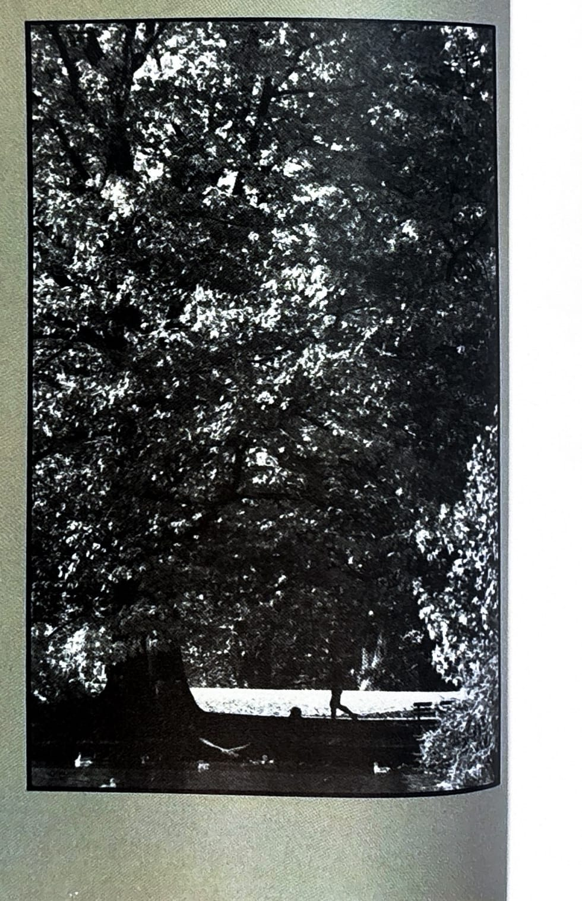

import RouteStats from "@/components/blog/RouteStats.astro";

<RouteStats
	routeNumber={frontmatter.routeNumber}
	section={frontmatter.section}
	distanceMiles={frontmatter.distanceMiles}
	distanceKm={frontmatter.distanceKm}
	distanceLabel={frontmatter.distanceLabel}
	difficulty={frontmatter.difficulty}
	beginningPoint={frontmatter.beginningPoint}
	runningSurface={frontmatter.runningSurface}
	conditions={frontmatter.routeConditions}
/>

<blockquote>

Laurelhurst Park sits right in the heart of the east side residential area and in nice weather is alive with joggers, stollers, sitters, and elderly citizens feeding ducks and swans. Easy access is assured by the park's location a block south of East Burnside. Park along Ankeny and enter along either of the walkways on that street.

Run these loops either way and as many times as feels right. If you still feel energetic, venture out and jog around some of the local neighborhoods. On summer week-end days, enjoy a concert while you're doing your stretches on the grassy field along Oak Street.

</blockquote>

_Photograph by Ancil Nance, from the original book._

