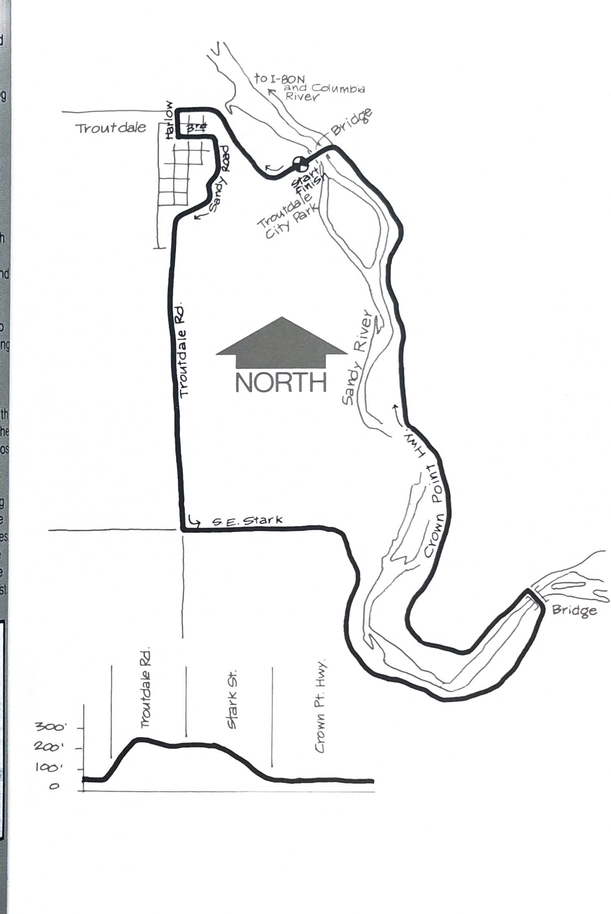
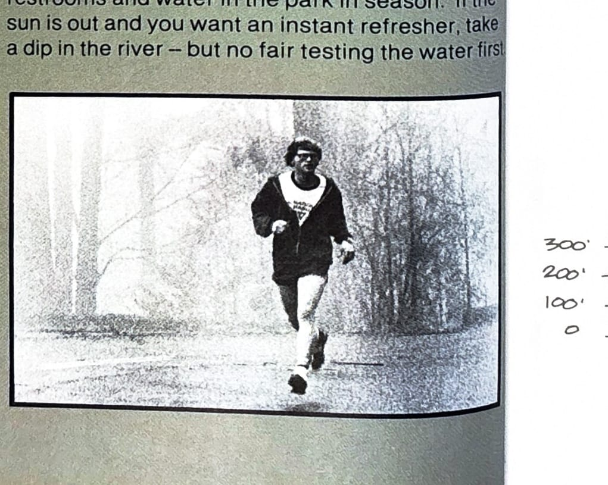

import RouteStats from "@/components/blog/RouteStats.astro";

<RouteStats
	routeNumber={frontmatter.routeNumber}
	section={frontmatter.section}
	distanceMiles={frontmatter.distanceMiles}
	distanceKm={frontmatter.distanceKm}
	difficulty={frontmatter.difficulty}
	beginningPoint={frontmatter.beginningPoint}
	runningSurface={frontmatter.runningSurface}
	suggestedBy={frontmatter.suggestedBy}
	conditions={frontmatter.routeConditions}
/>

<blockquote>

This loop (the course of an annual May road run) offers a quickly accessible, rustic diversion to city-dwelling runners with its fine sampling of the Sandy River Gorge. If the city blues and smog are getting you down, this anecdote of clean air, tall trees and rushing waters might be just the ticket.

Drive east on the Banfield Freeway (I-80 N) and watch for Troutdale signs. Follow them into the town, then continue through the business district and down the hill toward the river. Turn right into the city parking lot just before you reach the bridge.

Start your run at the parking lot. Turn left and head up the hill back into town, turning left at the second street (Harlow). Go up Harlow two blocks and left again on 3rd St. Continue to climb as 3rd winds around the front of the hill overlooking the river and turns into Sandy Road. In another half-mile or so, Sandy Road becomes Troutdale Road.

Follow Troutdale Road to its intersection with Stark Street, turn left and begin your descent to the river. Continue on Stark to the first bridge and cross over to the Crown Point Highway. Bear left back along the other side of the river.

The highway is narrow but has good running shoulders on both sides. Cross at the next bridge and head back to the park. There are picnic tables, restrooms and water in the park in season. If the sun is out and you want an instant refresher, take a dip in the river -- but no fair testing the water first.

</blockquote>

_Course map and elevation profile from the original book._

_Photograph by Ancil Nance, from the original book._

