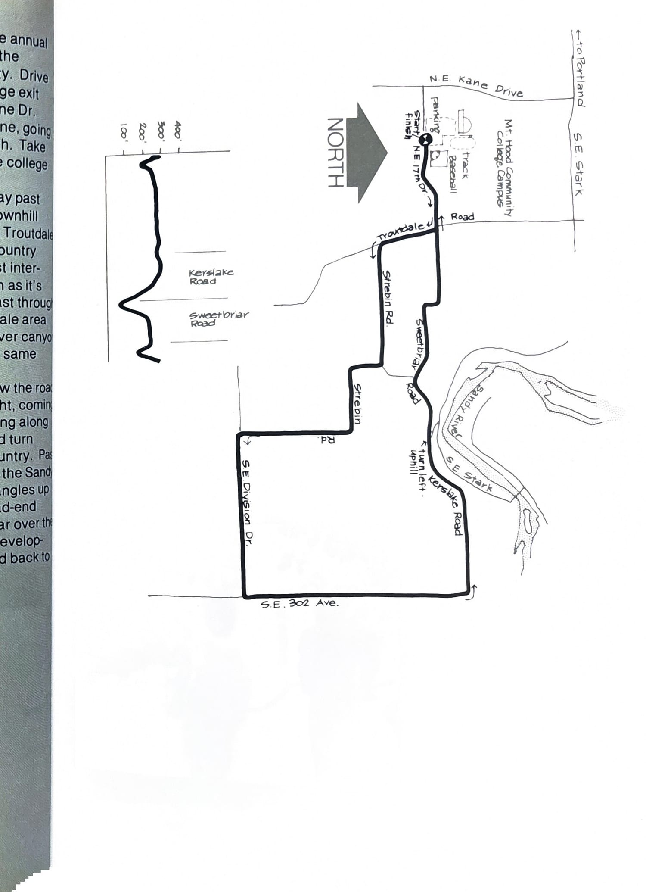

import RouteStats from "@/components/blog/RouteStats.astro";

<RouteStats
	routeNumber={frontmatter.routeNumber}
	section={frontmatter.section}
	distanceMiles={frontmatter.distanceMiles}
	distanceKm={frontmatter.distanceKm}
	difficulty={frontmatter.difficulty}
	beginningPoint={frontmatter.beginningPoint}
	runningSurface={frontmatter.runningSurface}
	suggestedBy={frontmatter.suggestedBy}
	conditions={frontmatter.routeConditions}
/>

<blockquote>

This beautiful loop, the scene of the annual Fred Meyer Run, offers a scenic tour of the least-known corner of Multnomah County. Drive out the Banfield and take the Wood Village exit to Stark St. Turn left on Stark to N.E. Kane Dr. and turn right at the college. Stay on Kane, going past the college and turn left on N.E. 17th. Take the second driveway on your left into the college parking lot.

Start running east from the driveway past the N.E. LaMesa Pl. street sign, going downhill to the creek and up the the STOP sign at Troutdale Road. Now you can start enjoying the country air. Run right on Troutdale Rd. to the first intersection, then go left (don't hunt for a sign as it's unmarked). Follow this road (Strebin) east through open farm land with the Corbett/Springdale area looming to your left across the Sandy River canyon and Larch Mountain further right on that same ridge.

Turn right at the first fork, and follow the road past the dilapidated red barn on your right, coming out on S.E. Division Drive. Go left, running along good shoulders on the road to 302nd and turn left again, heading back into farming country. Past a tree farm you'll begin the descent into the Sandy canyon. Take Sweetbriar Road, which angles up left a couple hundred yards past the dead-end road, also on your left. Follow Sweetbriar over the top of the hill straight past the housing development on your right to Troutdale Road and back to the starting point.

</blockquote>

_Course map and elevation profile from the original book._

