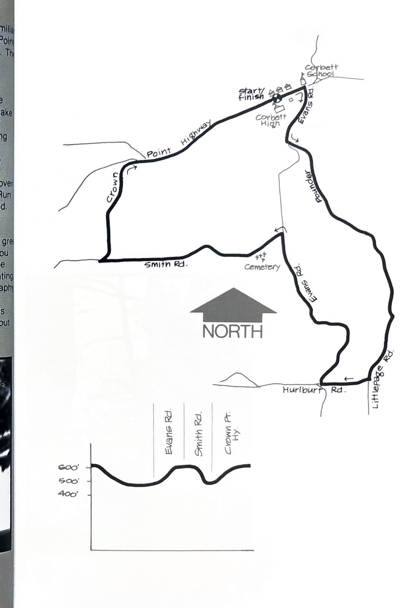
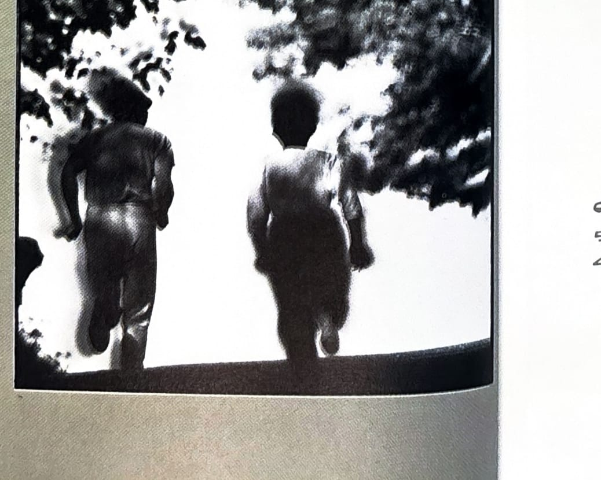

import RouteStats from "@/components/blog/RouteStats.astro";

<RouteStats
	routeNumber={frontmatter.routeNumber}
	section={frontmatter.section}
	distanceMiles={frontmatter.distanceMiles}
	distanceKm={frontmatter.distanceKm}
	difficulty={frontmatter.difficulty}
	beginningPoint={frontmatter.beginningPoint}
	runningSurface={frontmatter.runningSurface}
	suggestedBy={frontmatter.suggestedBy}
	conditions={frontmatter.routeConditions}
/>

<blockquote>

If you like the outdoors and aren't too familiar with the spectacular Columbia Gorge/Crown Point country, head for Corbett, weather permitting. The latter is important as the winds on top of the ridge can be very strong and in cold weather, outright nasty.

Drive out the Banfield Freeway along the Columbia River toward Multnomah Falls and take the Corbett Exit. Now you're in lower Corbett, but you aren't there yet! Follow the signs going straight up the mountain and be thankful you aren't running it. Turn right at the top, drive to the high school on your left and park there.

You're on top of the ridge looking south over farms and forest to the Sandy River canyon. Run about a block north and start down Evans Road. Take it easy and enjoy yourself, remembering what goes down, must come up.

Littlepage, Hurlburt and Evans Roads all greet you with stop signs and as you rejoin Evans, you begin to climb again. This countryside, and the homes and farms sprinkled over it, has a haunting dreamlike quality to it. It's not true that geography is a "dead" quality. Some places "live" and emanate their own particular vibrations - this is one of them. There's mystery in the air here, but don't let this scare you away.

</blockquote>

_Course map and elevation profile from the original book._

_Photograph by Ancil Nance, from the original book._

