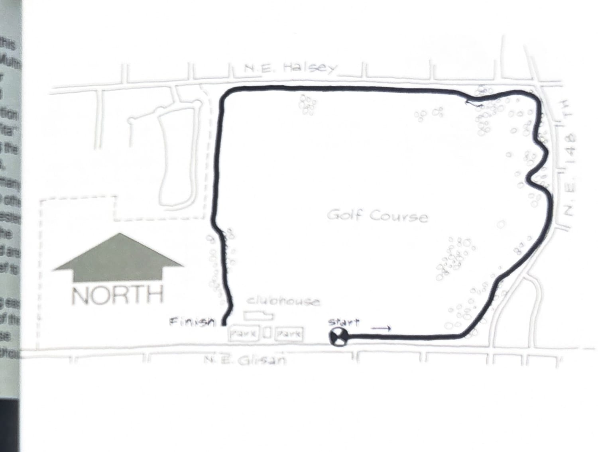
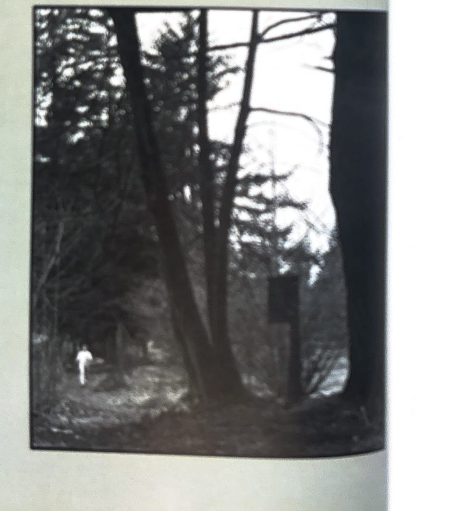

import RouteStats from "@/components/blog/RouteStats.astro";

<RouteStats
	routeNumber={frontmatter.routeNumber}
	section={frontmatter.section}
	distanceMiles={frontmatter.distanceMiles}
	distanceKm={frontmatter.distanceKm}
	difficulty={frontmatter.difficulty}
	beginningPoint={frontmatter.beginningPoint}
	runningSurface={frontmatter.runningSurface}
	suggestedBy={frontmatter.suggestedBy}
	conditions={frontmatter.routeConditions}
/>

<blockquote>

The Glendoveer loop is the only one in this book that was built exclusively for running. Multnomah County added this trail to its Glendoveer Golf Course -- an idea that could be repeated in a number of Portland golf courses. In addition to the running, you can take part in the 10 "Vita" exercises that occur at different points along the trail. These consist of doing chin-ups, sit-ups, push-ups, etc., and will probably be seen by many runners as an unnecessary interruption to an otherwise lovely run. Whether of not you are interested in "Vita" exercises, give Glendoveer a try. The course winds through some beautiful wooded areas and the soft wood-chip trail is a welcome relief to feet used to pounding hard pavement.

Glendoveer can be reached by traveling east on NE Glisan from 122nd. Look for the start of the trail about 1/4 mile to the right of the clubhouse. Water and restrooms are available at the clubhouse.

</blockquote>

_Course map from the original book._

_Photograph by Ancil Nance, from the original book._

