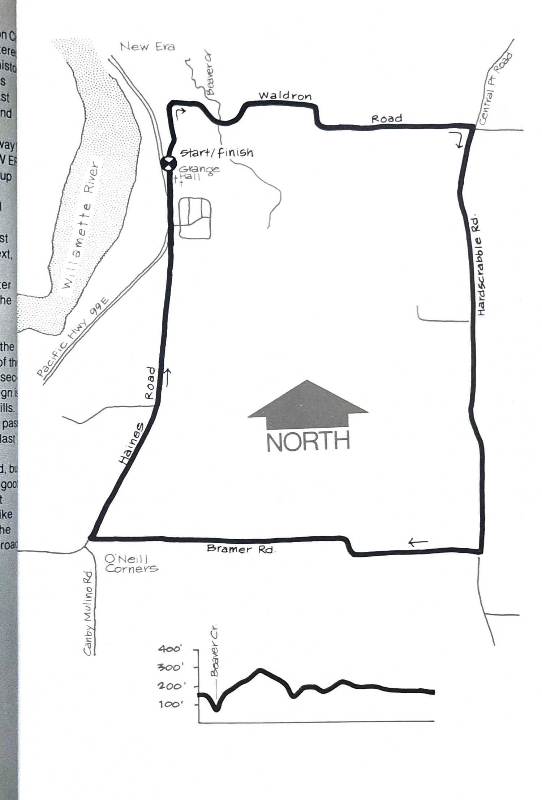

import RouteStats from "@/components/blog/RouteStats.astro";

<RouteStats
	routeNumber={frontmatter.routeNumber}
	section={frontmatter.section}
	distanceMiles={frontmatter.distanceMiles}
	distanceKm={frontmatter.distanceKm}
	difficulty={frontmatter.difficulty}
	beginningPoint={frontmatter.beginningPoint}
	runningSurface={frontmatter.runningSurface}
	suggestedBy={frontmatter.suggestedBy}
	conditions={frontmatter.routeConditions}
/>

<blockquote>

The Canby-New Era area south of Oregon City is steeped in some of the northwest's most interesting history. The New Era/Spiritualist Church history is one of the least-known aspects of this area's past. This loop winds around the farm land east of New Era and Canby, past old farm homes and rustic barns.

Driving south from Oregon City on Highway 99E watch for the WARNER GRANGE - CAMP NEW ERA CENTRAL POINT sign on your right as you go up a long hill. Take the first sharp turn to the left at the top of the hill and park in the grange hall lot a few yards down the road.

From the lot, turn right and run north, past an ancient farm and buildings on your left. Next, you'll pass the camp grounds of the New Era Spiritualist Church on your right, still in use after more than 100 years at that location. Follow the road down the hill and across the bridge over Beaver Creek.

At about the 1½ mile point, turn right at the Central Point Road sign. Run along the base of the hill and down into farms again to the first intersection. Turn right there (Bramer Road, but the sign is down) and continue west through the rolling hills. You'll know you're on the right path when you pass the Triple H Charolais Ranch at the top of the last hill.

Turn right at the next STOP (Haines Road, but again, no sign) and follow this wider road with good shoulders to its junction with Hwy. 99 just past the orchard. Run about 200 yards along the bike lane of the highway, and you'll come back to the NEW ERA turn off, with the grange just up the road.

</blockquote>

_Course map and elevation profile from the original book._

