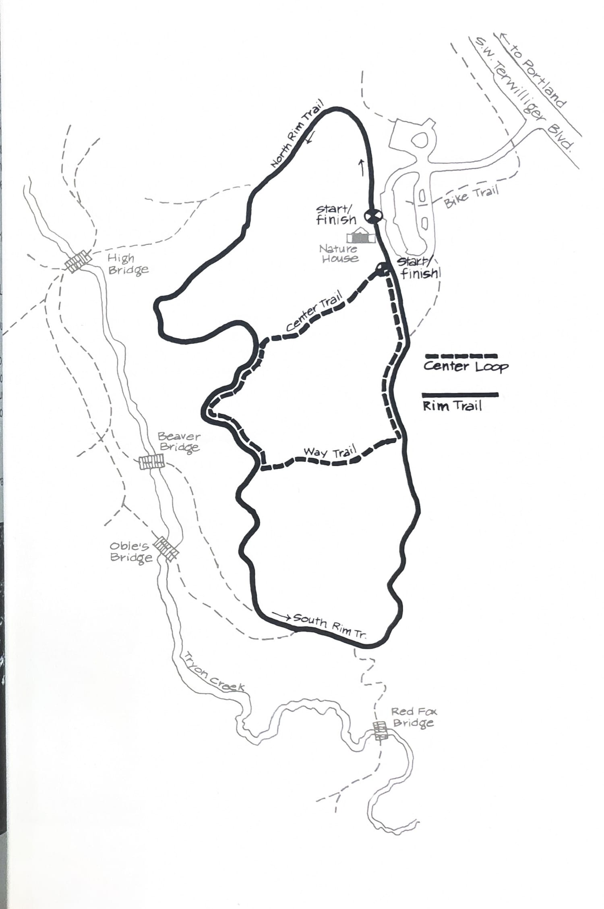
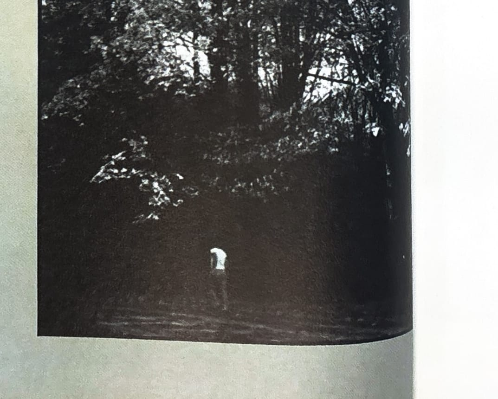

import RouteStats from "@/components/blog/RouteStats.astro";

<RouteStats
	routeNumber={frontmatter.routeNumber}
	section={frontmatter.section}
	distanceLabel={frontmatter.distanceLabel}
	beginningPoint={frontmatter.beginningPoint}
	runningSurface={frontmatter.runningSurface}
	suggestedBy={frontmatter.suggestedBy}
	conditions={frontmatter.routeConditions}
/>

<blockquote>

One of the most impressive recent environmental victories locally was the creation of Tryon Creek State park in 1975, an action originated by a group of local citizens intent on preserving this area as a wilderness sanctuary. This lovely forested park straddles Tryon Creek and shelters its passage through the swampy bottomlands as it runs from Boones Ferry Road near the Lewis and Clark Law School on the west down to State Street and Lake Oswego on the eastern border.

Drive south on Terwilliger from where it crosses I-5 and head toward the Lewis and Clark campus. Bear left at the Boones Ferry Road intersection staying on Terwilliger to the park entrance on your right (about 1/4 mile past the Law School).

Both of these short loops stay on high ground and offer nice views of the bottomlands below. Start at the Nature House. For the Center Loop jog a few yards east of the Nature House and you'll see the Center Trail heading off right. The Nature Center has displays and helpful information about the abundant flora and fauna indigenous to the Park and is open every day during most of the year.

Restrooms and a drinking fountain are available at the Center.

</blockquote>

_Course map from the original book._

_Photograph by Ancil Nance, from the original book._

