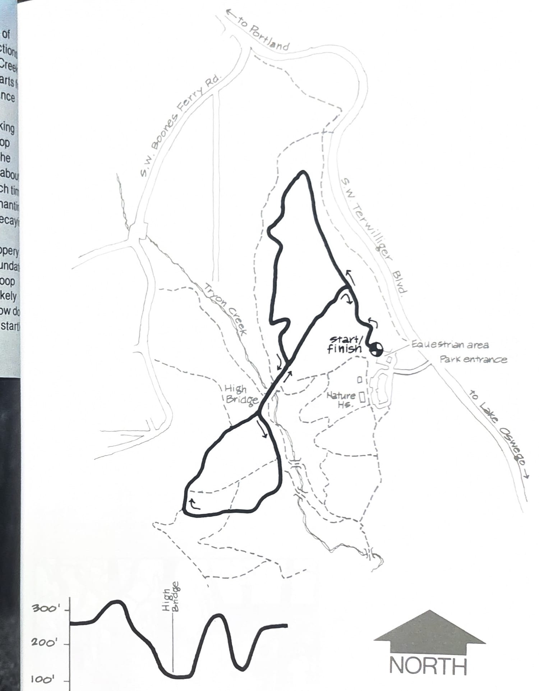
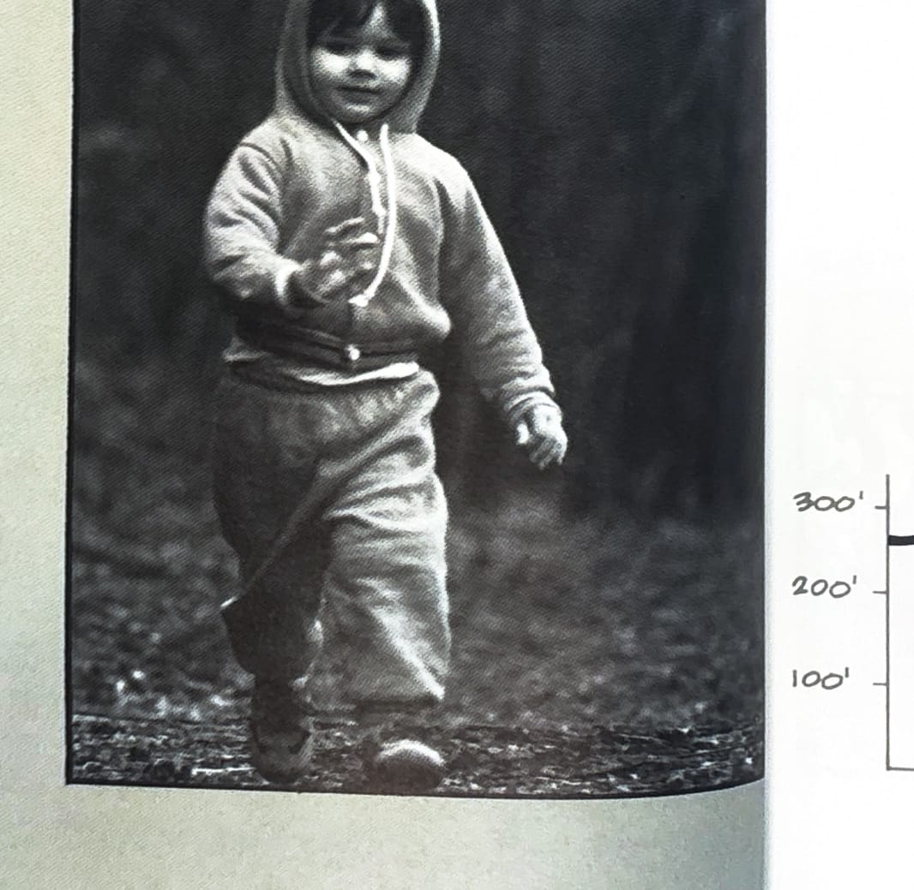

import RouteStats from "@/components/blog/RouteStats.astro";

<RouteStats
	routeNumber={frontmatter.routeNumber}
	section={frontmatter.section}
	distanceMiles={frontmatter.distanceMiles}
	distanceKm={frontmatter.distanceKm}
	difficulty={frontmatter.difficulty}
	beginningPoint={frontmatter.beginningPoint}
	runningSurface={frontmatter.runningSurface}
	suggestedBy={frontmatter.suggestedBy}
	conditions={frontmatter.routeConditions}
/>

<blockquote>

This fine loop gives you a tour of some of the highlights in this wilderness park. Directions to the park are given under the other Tryon Creek Run immediately preceding this. The run starts at the Equestrian area. Turn right off the entrance drive before you reach the Nature House.

Heading west on the trail from the parking area, stay right at the first fork and do the loop in a figure eight, bearing left after crossing the bridge in the canyon. You'll be descending about 125 feet to the creek and climbing again each time you cross. The creek area is especially enchanting with miniature swamps, sandy bars, huge decayed logs and abundant swamp flowers.

The bottomlands can become very slippery after heavy rains, sometimes completely inundated so watch the weather. This loop _is_ a horse loop (the only horse trail in the park) and you're likely to encounter one anytime. When you do, slow down and move to the side of the trail so as not to startle the horses.

</blockquote>

_Course map and elevation profile from the original book._

_Photograph by Ancil Nance, from the original book._

