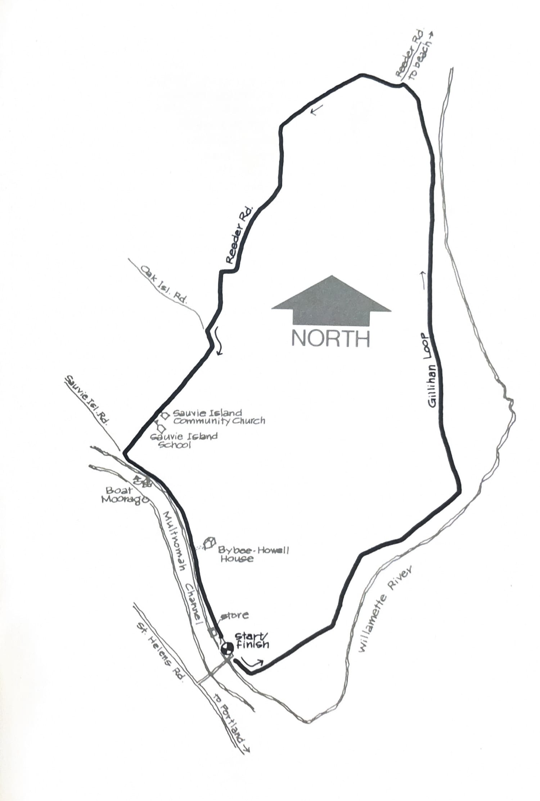
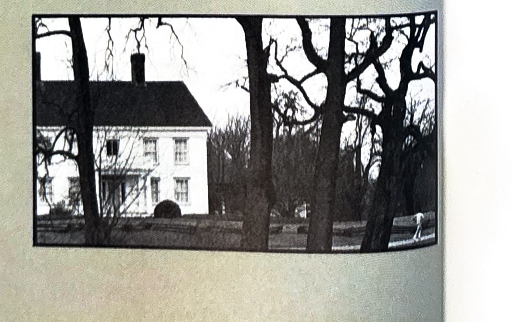

import RouteStats from "@/components/blog/RouteStats.astro";

<RouteStats
	routeNumber={frontmatter.routeNumber}
	section={frontmatter.section}
	distanceMiles={frontmatter.distanceMiles}
	distanceKm={frontmatter.distanceKm}
	difficulty={frontmatter.difficulty}
	beginningPoint={frontmatter.beginningPoint}
	runningSurface={frontmatter.runningSurface}
	suggestedBy={frontmatter.suggestedBy}
	conditions={frontmatter.routeConditions}
/>

<blockquote>

This is one of the popular training runs for the Portland and Seaside marathons. It's flat as a pancake, makes a nice, easy-to-follow circle, and offers a near half-marathon distance. Whether you are marathon training or not, Sauvie Island is a fine place to test yourself with some distance without the pain of hills. A few cautions: there's no water available so you'll have to stow your own. Also, the roads are narrow and get a fair amount of traffic on summer and fall weekends days.

Sauvie Island is about 7-8 miles north of Portland. Drive north on St. Helen's Road, through Linnton and look for the Sauvie Island signs. Cross the bridge and turn immediately to your left into the parking lot.

To hit the 12.5 miles on the nose, start at the north end of the parking lot by the bridge where the roads intersect. Run the loop counterclockwise going south under the bridge. You'll encounter two stop signs, the first one near the half-way point. Bear left at each sign, and the road will bring you back to the bridge. Stop where the road goes under the bridge to complete 12.5 miles.

Sauvie Island is an agricultural island and seems destined to stay that way. Summer and fall are particularly lovely times as the air is heavy with the pungent smells of farm life. Reeder Beach, a great place for a post-run swim and picnic, can be reached by turning right at the stop sign half-way around the island.

Near the 11 mile point, you'll pass the beautifully restored Bybee/Howell house on your left. It was built in 1854 and is a classic example of revival architecture.

</blockquote>

_Course map from the original book._

_Photograph by Ancil Nance, from the original book._

