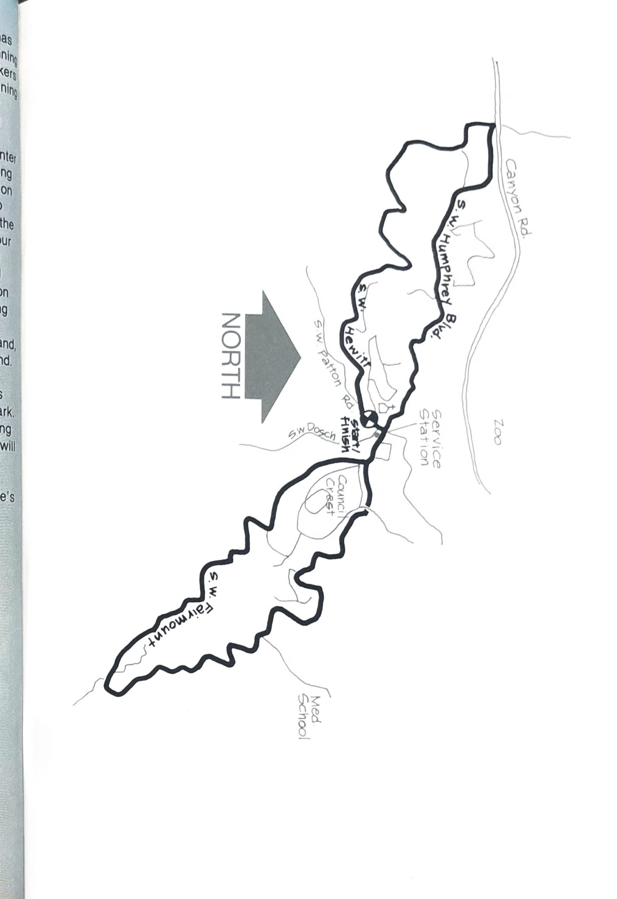

import RouteStats from "@/components/blog/RouteStats.astro";

<RouteStats
	routeNumber={frontmatter.routeNumber}
	section={frontmatter.section}
	distanceLabel={frontmatter.distanceLabel}
	difficulty={frontmatter.difficulty}
	beginningPoint={frontmatter.beginningPoint}
	runningSurface={frontmatter.runningSurface}
	suggestedBy={frontmatter.suggestedBy}
	conditions={frontmatter.routeConditions}
/>

<blockquote>

This roughly equidistant figure eight loop has long been one of the most popular west side running routes. It attracts local denizens as well as seekers from all over the city. It's a traditional early morning marathon training course and is an increasingly popular stomping ground for runners ascending from the YMCA and Portland State far below.

One popular starting point (in the exact center of the figure of the loop) can be reached by driving north on Dosch Road until it intersects with Patton by the Shell station. From West Burnside, go up Vista and follow Patton to the intersection from the other direction (St. Thomas Moore church on your right). An alternative is to drive west on Canyon and take the Sylvan Exit at the top of the hill and go left over the freeway to the Skyline Building on the right. Park there and use this as your starting point.

This loop offers a 360&deg; panorama of Portland, the hills, and the suburban areas west of Portland. On clear days the views are magnificent. For a pleasant diversion, take one of the many streets going uphill from Fairmont into Council Crest Park. The view from the summit is the most outstanding in the city, and arrows in the cement enclosure will help you identify the peaks in the distance.

The running on the loop is great, but try to stick to off-hours as the roads are narrow. There's a drinking fountain and restrooms at the Shell Station, but don't say we told you.

</blockquote>

_Course map from the original book._

