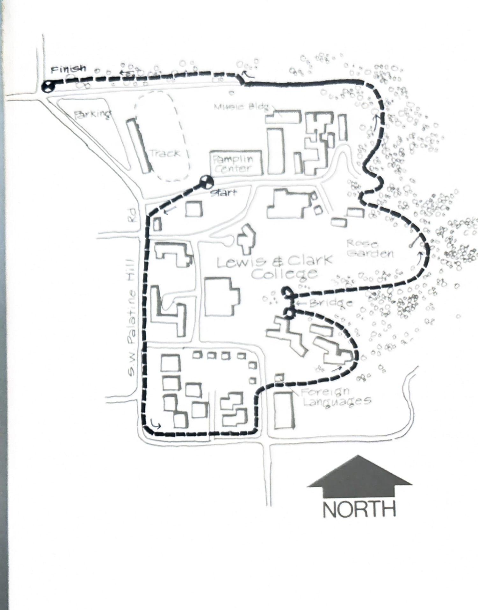

import RouteStats from "@/components/blog/RouteStats.astro";

<RouteStats
	routeNumber={frontmatter.routeNumber}
	section={frontmatter.section}
	distanceMiles={frontmatter.distanceMiles}
	distanceKm={frontmatter.distanceKm}
	difficulty={frontmatter.difficulty}
	beginningPoint={frontmatter.beginningPoint}
	runningSurface={frontmatter.runningSurface}
	suggestedBy={frontmatter.suggestedBy}
	conditions={frontmatter.routeConditions}
/>

<blockquote>

Lewis and Clark College in southwest Portland has one of the most beautiful campuses in the state, offering specacular scenic vistas that few campuses anywhere could match. A fine new jogging trail circumventing the campus opens up this lovely area to the general populace.

Drive south on I-5 and take the Terwilliger Blvd. exit, following the overpass and staying on Terwilliger south to its intersection with S.W. Palatine Road. Go left on Palatine and park in the lot by the athletic fields.

Jog south through the parking lot and go left at the road leading to the west entrance of the Sports Center. Ascend the stairs to the right of the door. The trail starts at the top of the stairs next to the building.

Run west on the road and watch for the pathway on your left. Cross through the bushes and you'll see the clearly delineated wood chip trail leading up the hill to the right between the chapel and the security gatehouse. Once you're on it, follow it all the way around the perimeter of the campus. There are adequate signs along the way.

When the trail stops at a road on the east side of the campus, look across the road and you'll see a sign pointing you to the right of the Foreign Languages building. On the other side is a small parking lot. Look for a TRAIL sign at the east end, and you're off into the woods.

Stay left on the main trail in the woods and, if the mood strikes you, take advantage of the many exercise stations along the way. Cross the bridge, go sharp left at the other side down under the bridge, and continue down the ravine. Breaking out at the top of the hill, run sharp right at the rose garden and go right again at the PALATINE ROAD sign.

Stay on the trail as it traverses around the hill and comes out of the woods by the Music Building parking lot on the north side of the campus. Now follow it running west along the driveway road to the finish at Palatine Road.

There are restrooms and water in Pamplin Center.

</blockquote>

_Course map from the original book._

