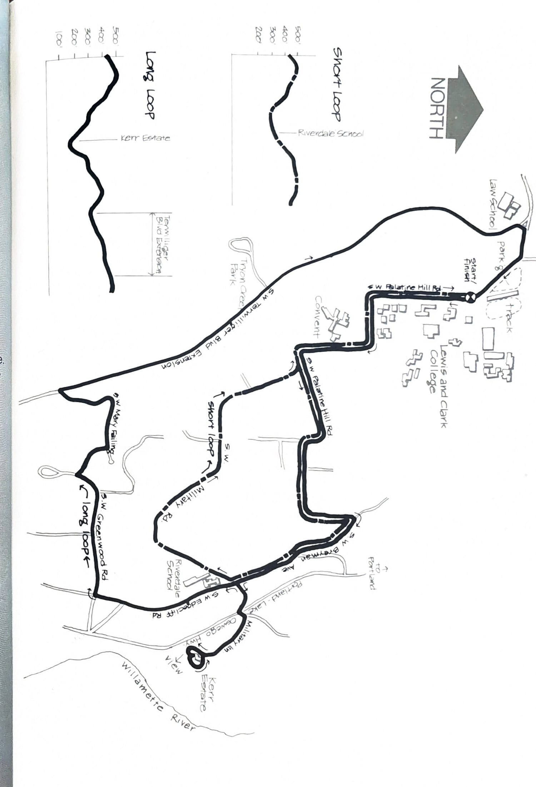

import RouteStats from "@/components/blog/RouteStats.astro";

<RouteStats
	routeNumber={frontmatter.routeNumber}
	section={frontmatter.section}
	distanceLabel={frontmatter.distanceLabel}
	beginningPoint={frontmatter.beginningPoint}
	runningSurface={frontmatter.runningSurface}
	suggestedBy={frontmatter.suggestedBy}
	conditions={frontmatter.routeConditions}
/>

<blockquote>

Here are two gems in the Palatine Hill/Dunthorpe area. The area offers endless possibilities of lovely jaunts along quiet, shaded streets and lanes, secluded estates, and beautiful gardens. To get there, follow the directions given in the previous Lewis and Clark campus loop. Both runs start and end at the main campus entrance, immediately south of the parking lot.

**Long Loop** &ndash; run south on Palatine up the hill then east and south again going away from the campus. Begin your long descent of the hill, following Palatine down to its intersection with Breyman Avenue. Go straight on Breyman to Military Road at about 1½ miles and turn left, dropping down the hill and crossing the Portland/Lake Oswego Highway. Turn right at Military Lane (a few yards down from the highway) and proceed south on this beautiful road to the Kerr Estate (now the Episcopal Diocese). Cross the parking lot and take the gravel trail immediately to the right of the house as it angles up the hill past rhododendrons and madronnas. Stay on the main trail to the rock-walled viewpoint above the Willamette.

Enjoy this beautiful and little known view of the Willamette River then head down the lower trail, going right at the next fork to the lower view point. Follow the trail down to the wood foot-bridge. Cross and stay right, running around the estate grounds and coming back to the entrance. Retrace your route back up to the intersection of Military Road and Breyman, going left on Breyman past the school. Greenwood, then Mary Failing, will take you to the top of the hill and a well-deserved plunge down the other side.

Where Failing dead ends, take the dirt road down right to Terwilliger, turn right and head back. Terwilliger has good shoulders on the right side.

**Short Loop** &ndash; Start at the same place and follow Palatine Road down the hill to Breyman Ave. Go straight on Breyman to Military Road and turn right and climb the hill by Riverdale School. Stay on Military Road all the way up to its intersection with Palatine, turn left and follow the road back to the starting place.

To include the tour through the Kerr estate gardens go left down Military Rd. and follow the directions on the Long Loop. It will add just a shade over a mile onto this run.

</blockquote>

_Course map and elevation profiles from the original book._

