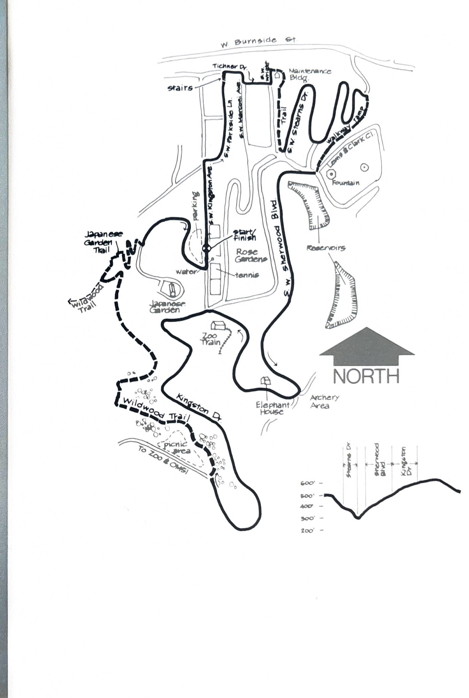

import RouteStats from "@/components/blog/RouteStats.astro";

<RouteStats
	routeNumber={frontmatter.routeNumber}
	section={frontmatter.section}
	distanceMiles={frontmatter.distanceMiles}
	distanceKm={frontmatter.distanceKm}
	difficulty={frontmatter.difficulty}
	beginningPoint={frontmatter.beginningPoint}
	runningSurface={frontmatter.runningSurface}
	suggestedBy={frontmatter.suggestedBy}
	conditions={frontmatter.routeConditions}
/>

<blockquote>

This is an excellent loop for the beginning jogger, one offering scenic beauty as well as a tour of Washington Park's more well-known attractions.

To get there, drive west on upper Burnside about a half mile past the Uptown Shopping area to the yellow blinking light. Take a sharp left and climb the hill to S.W. Kingston Ave. Drive south on Kingston Ave. several blocks to the parking area which will be on your right.

Start by the drinking fountain in the middle of the tennis court area and run north on Kingston Drive. Turn right at Parkside Lane passing a particularly scenic vista of the city. At the end of the lane, descend the stairs and turn right on Tichner, then left on Tichner Drive for one block. Go left at Wright, jog a short half block, and pick up the trail going off to the right at he end of the street. Stay on the trail as it winds around the hill coming out at Stearns Drive. Bear left, following the switchbacks down the hill until you see the cement walking ramp going up to the right.

Follow the ramp up to Lewis and Clark Circle (the fountain area) and run across the wide intersection, angling right, and get on Sherwood Road running around the reservoir. Follow Sherwood past the archery field and the old elephant house to its intersection with Kingston Ave. at the south end of the tennis courts.

Now the work begins. Run left up the steep grade, following Kingston Drive as it climbs through Douglas fir to the Zoo. About 3/4 mile up the road, bear right at the parking lot and pick up Wildwood Trail a few yards into the trees. Go straight at the trail fork, and run up the canyon and along the hill overlooking the Japanese Garden.

Turn right off Wildwood at the next fork and follow the Japanese Garden Trail as it descends to the paved road. Turn left on the road and run 1/4 mile down to your car.

</blockquote>

_Course map and elevation profile from the original book._

