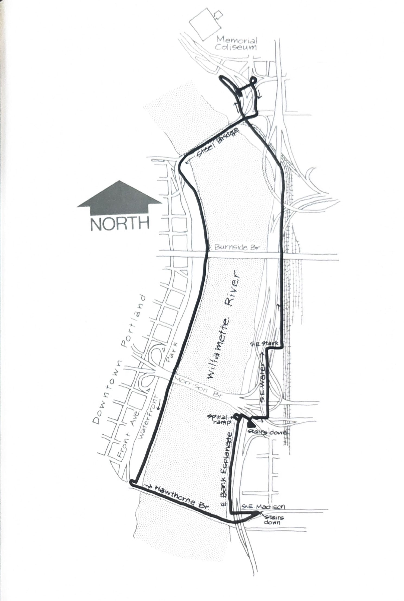

import RouteStats from "@/components/blog/RouteStats.astro";

<RouteStats
	routeNumber={frontmatter.routeNumber}
	section={frontmatter.section}
	distanceMiles={frontmatter.distanceMiles}
	distanceKm={frontmatter.distanceKm}
	difficulty={frontmatter.difficulty}
	beginningPoint={frontmatter.beginningPoint}
	runningSurface={frontmatter.runningSurface}
	suggestedBy={frontmatter.suggestedBy}
	conditions={frontmatter.routeConditions}
/>

<blockquote>

We searched long and hard for a run that looped around both sides of the downtown waterfront without crossing any major lanes of traffic. We found it.

Begin and end at any point along the downtown waterfront park. Run south along the seawall and take the stairway leading to the north walkway of the Hawthorne Bridge. Cross on the bridge and take the first stairway down to ground level at the intersection of S.E. Water and Madison streets. Run immediately back toward the river through the parked trucks. Turn right at the fire station and weave your way through the obstructions for about half a block until you see the paved asphalt marking the beginning of the East Bank Esplanade.

The next 1/4 mile as you run north offers a rarely seen view of downtown Portland, unfortunately ending at the Morrison Bridge. Take the spiral ramp at the bridge, turn right at the top. Run until you come to the ramp winding down right (just beyond the stairs) and take that down to the ground level. Turn right there and follow the walkway until you come to S.E. Water St. Take a left. Run north on Water until you come to the wall at Stark St. and bear right to the railroad tracks.

Turn left at the tracks and run along the left side of the tracks about 3/4 mile on dirt and gravel with the river on your left. You'll pass under the Burnside Bridge, freeway ramps, and then the Steel Bridge. Look to your right and you'll see the road ascending the hill in back of the powerplant. Run up that road and turn sharp right at the top and cross the parking lot to the walkway leading to the north sidewalk of the Steel Bridge.

Running along the walkway, take the first stairway down, before you reach the bridge. Take the pedestrian path through two brief tunnels, emerging on N.E. Holladay. Go left up the stairs and left again at the roadway. In a few hundred feet you'll reach yet another underpass. This one will take you to the south walkway of the Steel Bridge and any easy run back to your starting point.

</blockquote>

_Course map from the original book._

