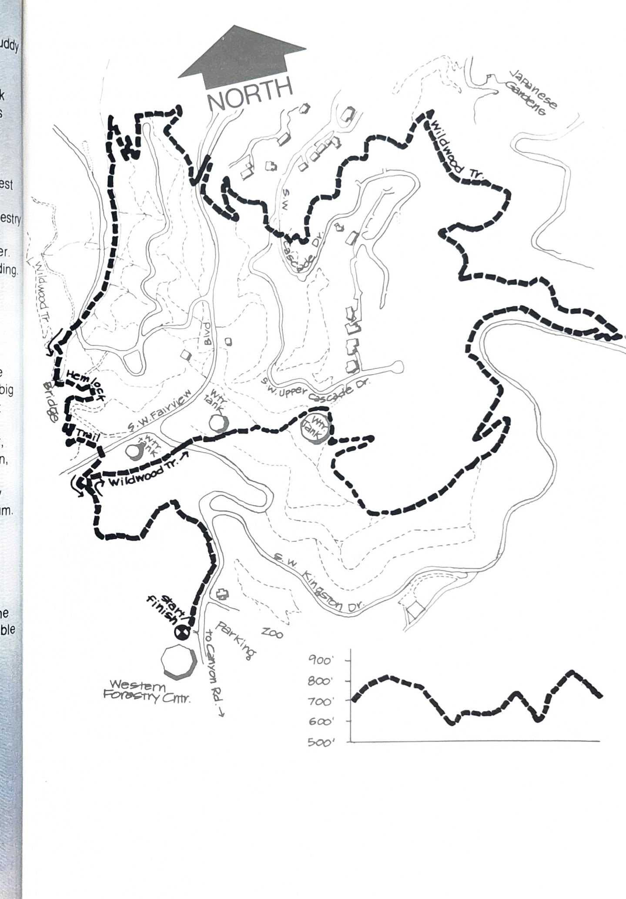

import RouteStats from "@/components/blog/RouteStats.astro";

<RouteStats
	routeNumber={frontmatter.routeNumber}
	section={frontmatter.section}
	distanceMiles={frontmatter.distanceMiles}
	distanceKm={frontmatter.distanceKm}
	difficulty={frontmatter.difficulty}
	beginningPoint={frontmatter.beginningPoint}
	runningSurface={frontmatter.runningSurface}
	suggestedBy={frontmatter.suggestedBy}
	conditions={frontmatter.routeConditions}
/>

<blockquote>

This lovely, forested trail becomes very muddy and slippery during heavy rains, particularly the stretches above the Japanese Garden and the section coming up the creek bed below Hemlock Trail. However, don't let that discourage you, as this loop is certainly one of the most beautiful walking/jogging trails in the country, and many people run it year 'round. Your shoes may get muddy, but you'll enjoy running through the largest arboretum in the world.

Take Canyon Road west and exit at the Forestry Center sign. Go past the zoo entrance to the far parking lot in front of the Western Forestry Center. The Wildwood trailhead is to the right of the building.

Run to the crest of the hill 1/4 mile from the start, stop and do some stretches while enjoying the splendid view in all directions. A marker between the water towers will help you identify the mountains on a clear day.

Follow Wildwood Trail as it goes around the east water tower and angles down the hill to the big open playing field on Kingston Drive. Go straight across the field and pick up the trail again in the woods. Take the left fork some 300 yards further, traversing the slopes above the Japanese Garden, keeping left at the trail intersection. Follow Wildwood as it angles up the hill, across Fairview Blvd., and down the other side into Hoyt Arboretum.

Around the 3 mile point (in the larch trees), leave Wildwood Trail by the wooden footbridge and take Hemlock Trail as it switchbacks up the hill and returns to Fairview. Cross the road and pick up the trail again as it descends through junipers, rejoining Wildwood for the run back to the Forestry Center. Restrooms and water are available next to the Forestry Center.

</blockquote>

_Course map and elevation profile from the original book._

See also the [fold-out Wildwood Trail map](/posts/running-around-portland/wildwood-trail-fold-out-map/) covering this and the neighboring Forest Park loops.

