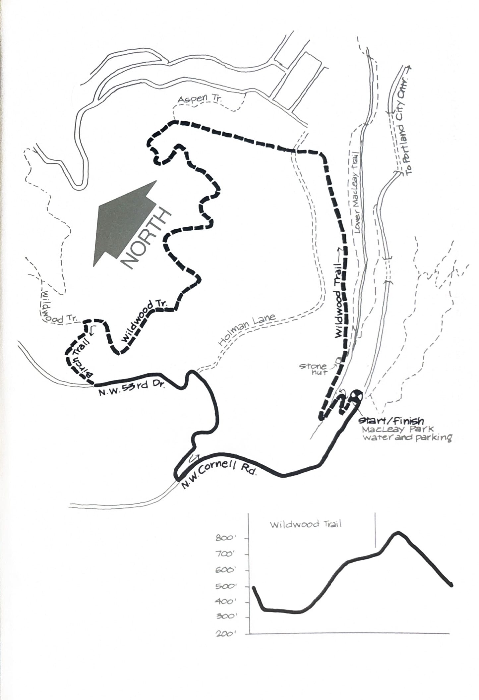
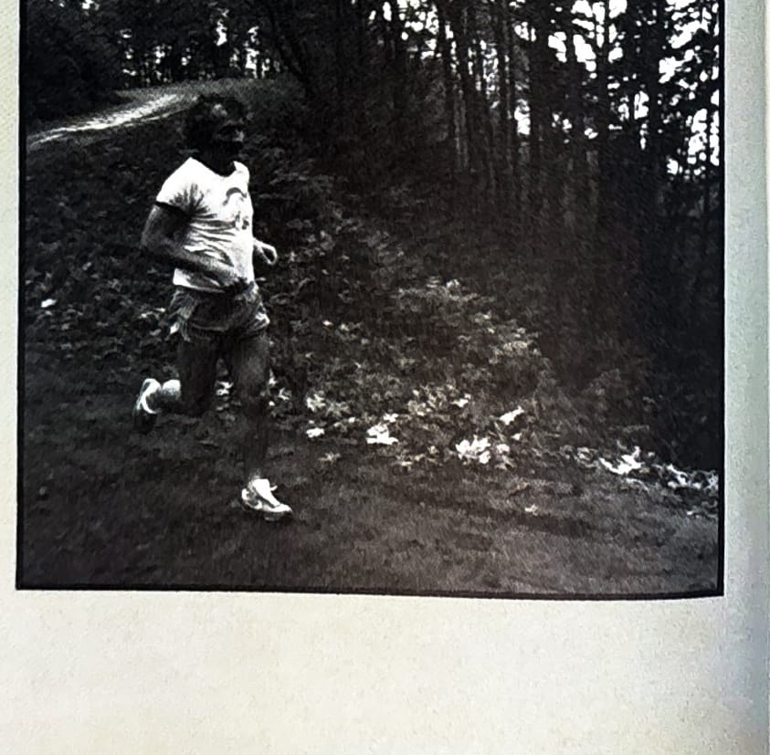

import RouteStats from "@/components/blog/RouteStats.astro";

<RouteStats
	routeNumber={frontmatter.routeNumber}
	section={frontmatter.section}
	distanceMiles={frontmatter.distanceMiles}
	distanceKm={frontmatter.distanceKm}
	difficulty={frontmatter.difficulty}
	beginningPoint={frontmatter.beginningPoint}
	runningSurface={frontmatter.runningSurface}
	suggestedBy={frontmatter.suggestedBy}
	conditions={frontmatter.routeConditions}
/>

<blockquote>

If you're looking for a 30-40 minute run that is secluded, forested and easily accessible by car, try this one.

Follow N.W. Lovejoy which becomes Cornell at 26th. Drive up Cornell through two tunnels to the Macleay Park parking lot on your right. There's a drinking fountain by the turn-in.

Get on the Wildwood Trail at the east end of the parking lot, and descend steeply a hundred feet to Balch Creek. Cross the creek, stay on Wildwood and take the left fork at the stone hut. You'll be going uphill gradually for quite a distance, so take it easy and conserve your energy.

At around 2½ miles turn left onto Birch Trail. Climb through Douglas fir and alder 1/4 mile to the parking lot on N.W. 53rd Drive. Go left on 53rd Drive as it descends steeply to Cornell. Turn left again on Cornell. Cross to the right side of Cornell where there is a broader shoulder. Now's a good time to stretch out your legs as you run 1/2 mile on a gentle downhill grade to the Pittock Bird Sanctuary and Oregon Audubon Society building. The last 1/4 mile is slightly uphill back to Macleay Park and your car.

There's a drinking fountain by the park sign, where Wildwood crosses Cornell.

</blockquote>

_Course map and elevation profile from the original book._

_Photograph by Ancil Nance, from the original book._

See also the [fold-out Wildwood Trail map](/posts/running-around-portland/wildwood-trail-fold-out-map/) covering this and the neighboring Forest Park loops.

