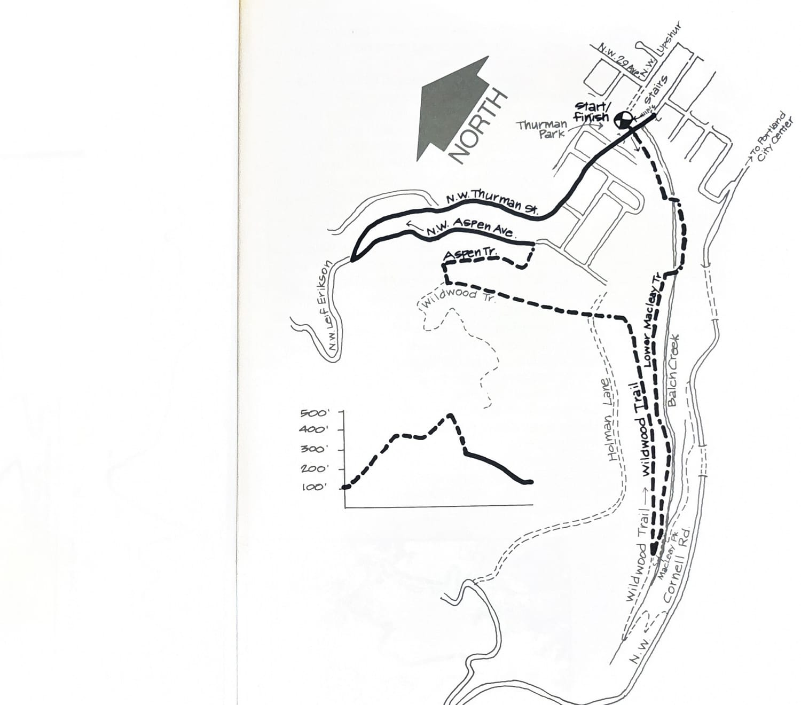
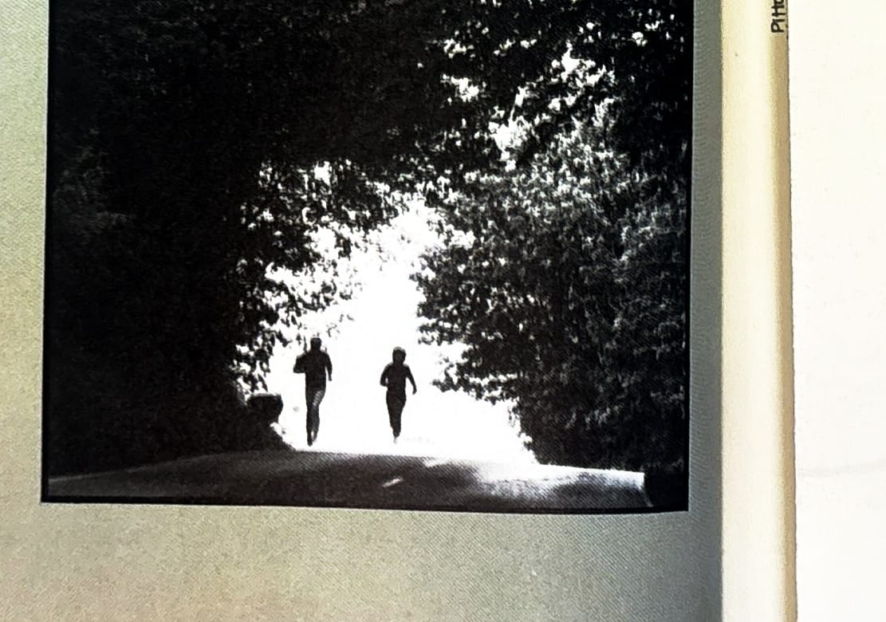

import RouteStats from "@/components/blog/RouteStats.astro";

<RouteStats
	routeNumber={frontmatter.routeNumber}
	section={frontmatter.section}
	distanceMiles={frontmatter.distanceMiles}
	distanceKm={frontmatter.distanceKm}
	difficulty={frontmatter.difficulty}
	beginningPoint={frontmatter.beginningPoint}
	runningSurface={frontmatter.runningSurface}
	suggestedBy={frontmatter.suggestedBy}
	conditions={frontmatter.routeConditions}
/>

<blockquote>

This is a very beautiful run through heavy forest, lush with ferns and mosses. The first mile follows Balch Creek up a canyon past cascading waterfalls and over several bridges.

The run begins at Thurman Park. To get to the park, drive west on N.W. Thurman to 28th, taking a right turn and a short jog left to N.W. Upshur. Proceed two long blocks west and drive straight into the park. Parking, restrooms and water are all available next to the park headquarters building.

Take the path running along the creek from the west end of the parking lot. Make a sharp right turn at the stone hut and get on Wildwood Trail, winding uphill and across the maintenance road above the meadow as it climbs further into Forest Park.

About a mile from the creek, watch for the Aspen Trail sign pointing down to your right. Aspen Trail angles down steeply and emerges on N.W. Aspen Street in the Willamette Heights residential area. Run left on Aspen to where it merges with Thurman, running downhill to the bridge. Cross the bridge and take the stairs on the left side of the street back to your car in the lot below.

</blockquote>

_Course map and elevation profile from the original book._

_Photograph by Ancil Nance, from the original book._

See also the [fold-out Wildwood Trail map](/posts/running-around-portland/wildwood-trail-fold-out-map/) covering this and the neighboring Forest Park loops.

