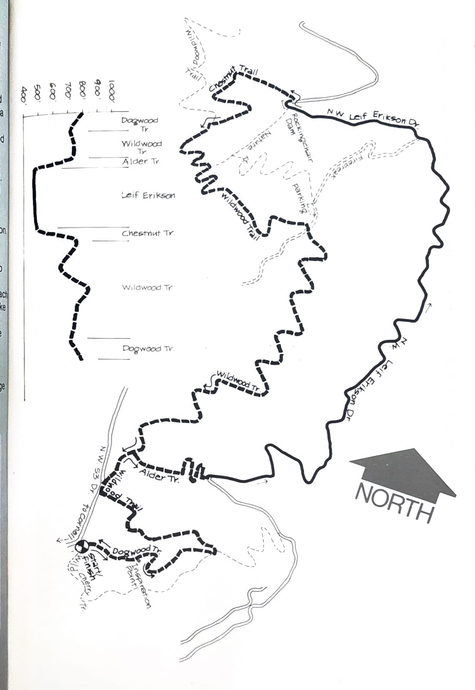
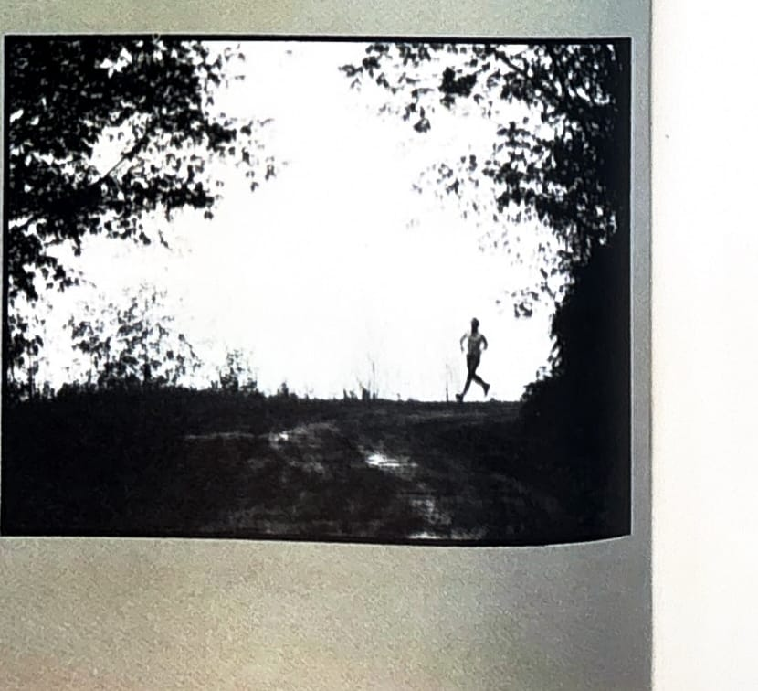

import RouteStats from "@/components/blog/RouteStats.astro";

<RouteStats
	routeNumber={frontmatter.routeNumber}
	section={frontmatter.section}
	distanceMiles={frontmatter.distanceMiles}
	distanceKm={frontmatter.distanceKm}
	difficulty={frontmatter.difficulty}
	beginningPoint={frontmatter.beginningPoint}
	runningSurface={frontmatter.runningSurface}
	suggestedBy={frontmatter.suggestedBy}
	conditions={frontmatter.routeConditions}
/>

<blockquote>

Here's a loop that offers a connoisseur's selection of what running in the upper reaches of Forest Park is all about.

Drive up N.W. Lovejoy to where it becomes Cornell at 26th Avenue and follow Cornell over a mile to 53rd Drive. Turn right on 53rd Drive and follow it to the parking place with a trail gate and a sign saying -- FOREST PARK-RIDGE TRAIL.

Two trails take off from here. Take Dogwood Trail (on the left) for a short climb through fir, alder and ferns to the top of the ridge. Enjoy the sweeping view in the clearing at Inspiration Point. Then, follow the trail as it descends the ridge and meets Wildwood Trail below. Turn on Wildwood, climbing slowly to where it meets 53rd Dr. and descending gradually to the Alder Trail intersection.

Jog right on Alder, dropping 1/4 mile to dirt-surfaced Leif Erikson Drive. Go left on the road for approximately 2 miles of easy uphill running to the old dam site on your left. You'll pass many viewpoints of the city on your way. As you approach the parking area and picnic tables on your left, take Chestnut Trail ahead of you and climb a winding 3/8 mile to Wildwood again. Turn left and prepare to enjoy one of the most beautiful stretches of forested running trail available anywhere as you retrace your steps back to Dogwood Trail. Save some energy for the climb back up Dogwood Ridge to Inspiration Point, then enjoy the easy descent back to the parking area.

</blockquote>

_Course map and elevation profile from the original book._

_Photograph by Ancil Nance, from the original book._

See also the [fold-out Wildwood Trail map](/posts/running-around-portland/wildwood-trail-fold-out-map/) covering this and the neighboring Forest Park loops.

