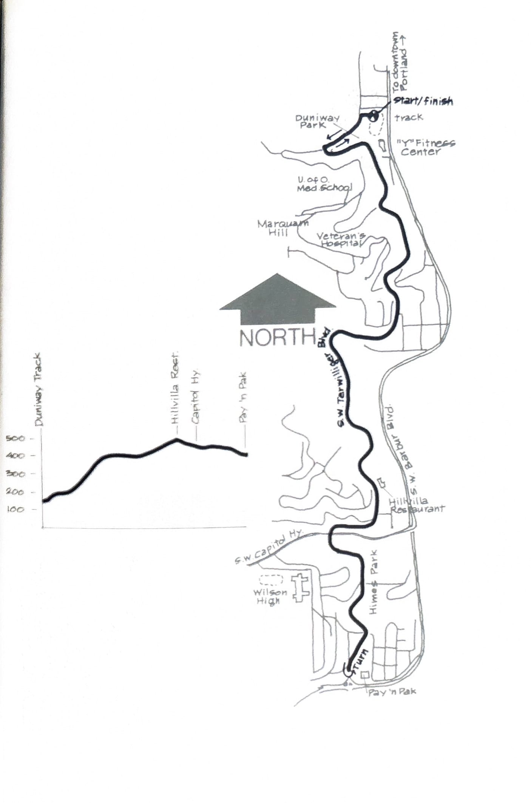

import RouteStats from "@/components/blog/RouteStats.astro";

<RouteStats
	routeNumber={frontmatter.routeNumber}
	section={frontmatter.section}
	distanceLabel={frontmatter.distanceLabel}
	difficulty={frontmatter.difficulty}
	beginningPoint={frontmatter.beginningPoint}
	runningSurface={frontmatter.runningSurface}
	suggestedBy={frontmatter.suggestedBy}
	conditions={frontmatter.routeConditions}
/>

<blockquote>

This is without a doubt the most popular jogging route in the Portland area, due to the recent opening of the YMCA's Metro Fitness Center on Barbur beside the Duniway track. Runners can be seen jogging up the long, gradual ascent to the Hill Villa at literally any hour of the day.

On nice days there are runners of all ages and sexes along the whole route. This isn't stated to deter you from running Terwilliger; there's much to be said for the presence of other runners to serve as a positive stimulus to push one along the path with considerable less boredom and pain.

Terwilliger is the starting point of numerous runs up into the hills. We're going to give you the two basic routes staying only on Terwilliger. The stretch from just above the track to the Hill Villa Restaurant offers beautiful views of the City and the Willamette River-Oaks Park area.

Start from the south end of the Duniway Track near the YMCA steps and head up the paved path on the left by the restrooms. Follow this up to Sam Jackson Park Road, turn left and follow the path to the intersection by the Shell Station. Go left up the hill on Terwilliger. You'll be going gradually uphill for two miles to the Hill Villa Restaurant. Continue past Hill Villa down the hill to the stop light at SW Capitol Highway. If you turn around here, and run back to Duniway Park, you will have run 5.5 miles.

For a little more distance, cross Capitol Highway and get on the asphalt path following Terwilliger through George Himes Park. Coming up a hill you'll leave the park, but stay on the sidewalk and run the remaining few blocks downhill to SW Barbur Blvd. Retrace your steps back to Duniway Park and you'll have covered 6.9 miles. If you like even numbers in your daily log book, do a complete lap on the track at the end and you've got a safe 7 miles.

</blockquote>

_Course map and elevation profile from the original book._

