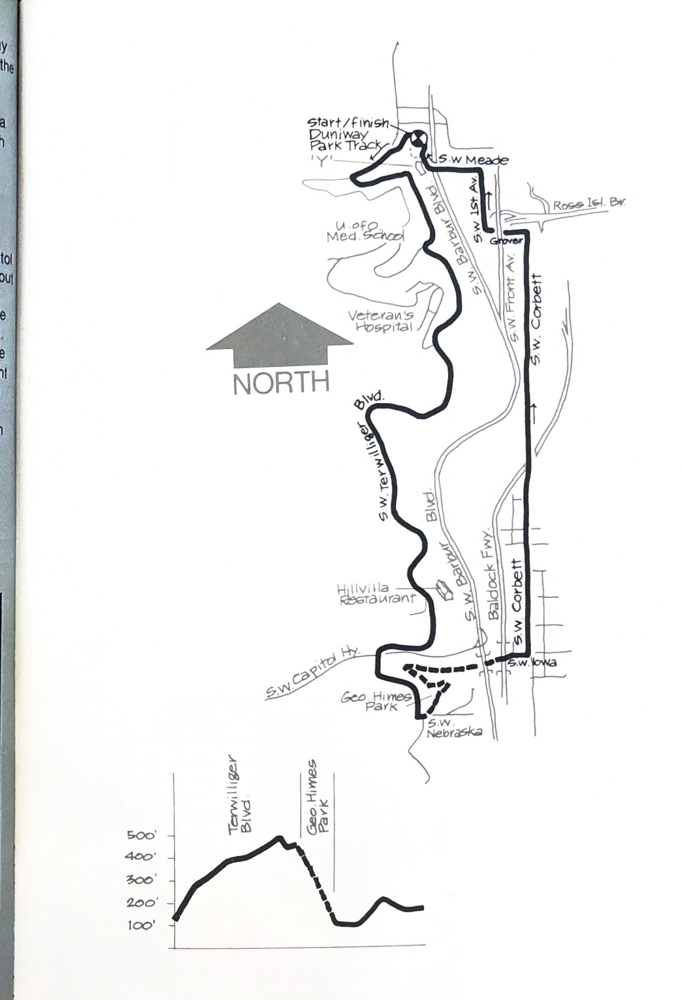
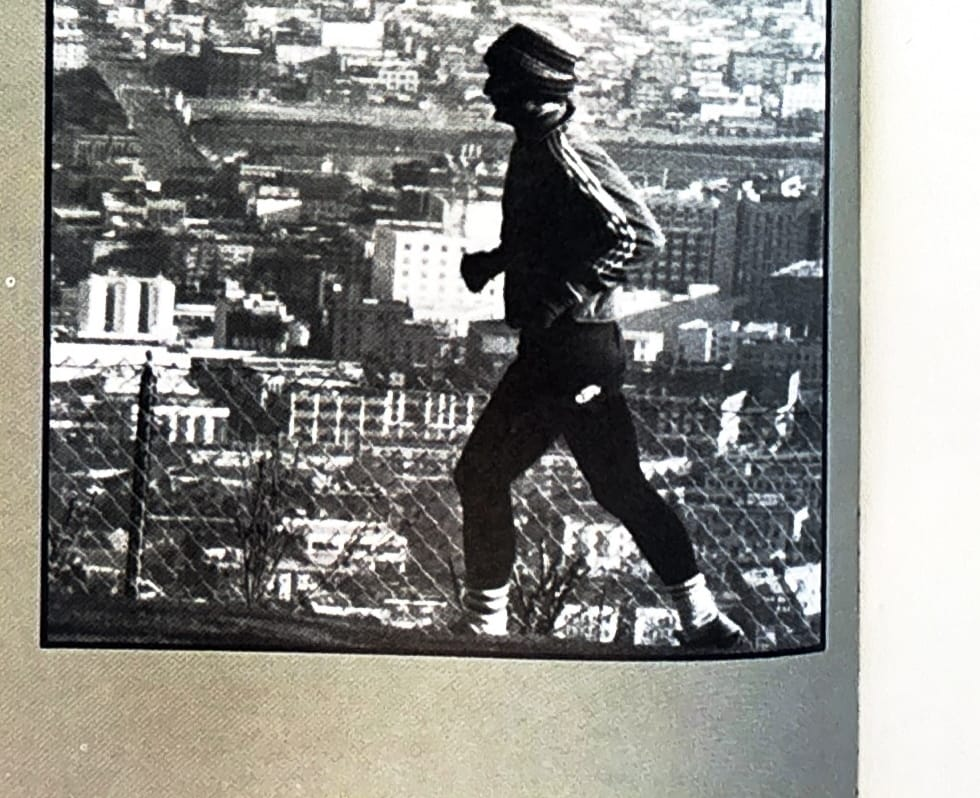

import RouteStats from "@/components/blog/RouteStats.astro";

<RouteStats
	routeNumber={frontmatter.routeNumber}
	section={frontmatter.section}
	distanceMiles={frontmatter.distanceMiles}
	distanceKm={frontmatter.distanceKm}
	difficulty={frontmatter.difficulty}
	beginningPoint={frontmatter.beginningPoint}
	runningSurface={frontmatter.runningSurface}
	suggestedBy={frontmatter.suggestedBy}
	conditions={frontmatter.routeConditions}
/>

<blockquote>

This scenic loop, a variation of the Duniway Park/Terwilliger Run, is a closely-kept secret of the YMCA's 6:00 A.M. "dawn patrol." A special feature is a traverse of one of the least known parks in the city (George Himes) which harbors a wooded foot access from Terwilliger underneath Barbur and I-5 to the Corbett/Macadam Avenue area below.

To reach Duniway Park, travel south from downtown Portland on 5th Avenue to the park.

Start at the south end of the track and run up Terwilliger as in the previous run. Cross Capitol Highway at the light and proceed on the path about 1/4 mile to S.W. Nebraska. Turn left at the sign, run about 50 feet, turn left toward the picnic table and descend the wide trail immediately behind it. Stay on the main trail, angling right along the side of the ravine, following it to the bottom. Bear right down the ravine, under the bridges, coming onto Corbett at Iowa Street.

Run north on Corbett to its end, then turn on Grover and follow the underpass as it merges with 1st Avenue. Go 3 blocks to Mead and turn left, staying on Mead to its end. Now take the narrow dirt road to the left and it will bring you out on Barbur, across from the YMCA. Cross Barbur and jog a few yards to the track.

</blockquote>

_Course map and elevation profile from the original book._

_Photograph by Ancil Nance, from the original book._

