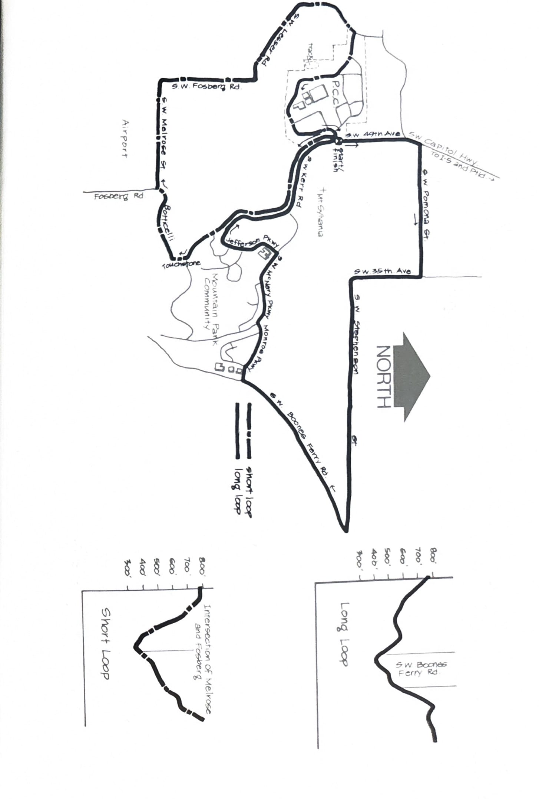

import RouteStats from "@/components/blog/RouteStats.astro";

<RouteStats
	routeNumber={frontmatter.routeNumber}
	section={frontmatter.section}
	distanceLabel={frontmatter.distanceLabel}
	beginningPoint={frontmatter.beginningPoint}
	runningSurface={frontmatter.runningSurface}
	suggestedBy={frontmatter.suggestedBy}
	conditions={frontmatter.routeConditions}
/>

<blockquote>

The area surrounding the Mt. Sylvania Campus of Portland Community College and the Mountain Park housing development contains many pleasant running routes. Here are a couple that Val Vitums of PCC's PE department says are local favorites. Try them and you'll see why.

Both runs begin at the entrance to the campus on S.W. 49th. Take the Capitol Highway exit off I-5 and follow the signs to the College.

**Long Loop** &ndash; head north down 49th Avenue from the campus entrance to Pomona and turn right. Traffic is light as you work your way down long hills past wooded areas and scattered homes. At the top of the Stephenson Hill by the school you'll enjoy beautiful views of the surrounding countryside, Mt. St. Helens and Mt. Hood. The stretch south of Boones Ferry Road runs between broken agricultural land on the right and Tryon Creek State Park on the left.

Turn right up Monroe at the Mountain Park development. Take another right at McNary Parkway and continue up the hill to Jefferson Parkway where you turn left. Turn right at Kerr Parkway for the 3/4 mile run back to the starting point.

**Short Loop** &ndash; this is a fine run through some beautiful country hidden away between the PCC campus and Lake Grove. Run south on 49th toward Mountain Park and watch for the Touchstone entrance at about 1 mile. Turn right here and drop down the hill. Take a right at Botticelli and run to the bottom of the hill and out of the development. Turn right at the first road (Melrose) and follow it west with trees on your right and an airport on your left.

Bear right at Forsberg and follow the road all the way to the west entrance of the campus on Lesser Road. Turn right into the campus and run uphill, bearing right at the first driveway. Run south past the track to the parking lot at the south end of the campus. Take a left and follow the outside edge of the parking lot uphill to the starting point.

</blockquote>

_Course map and elevation profiles from the original book._

