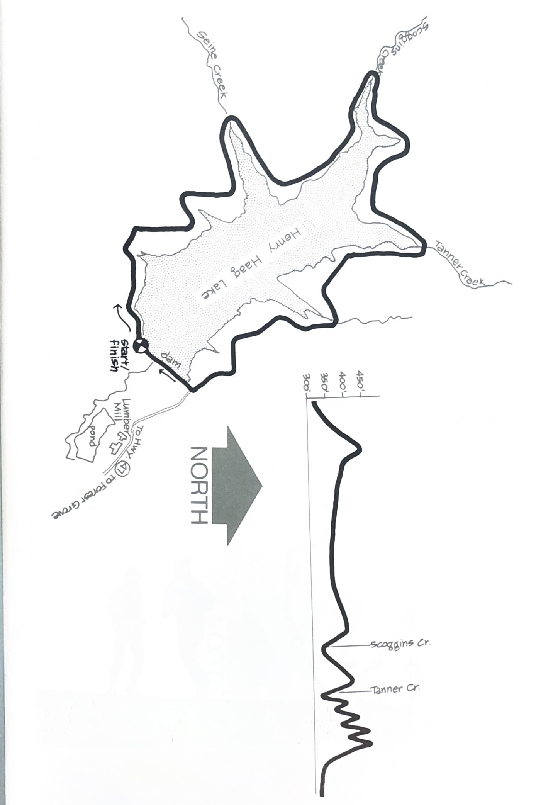
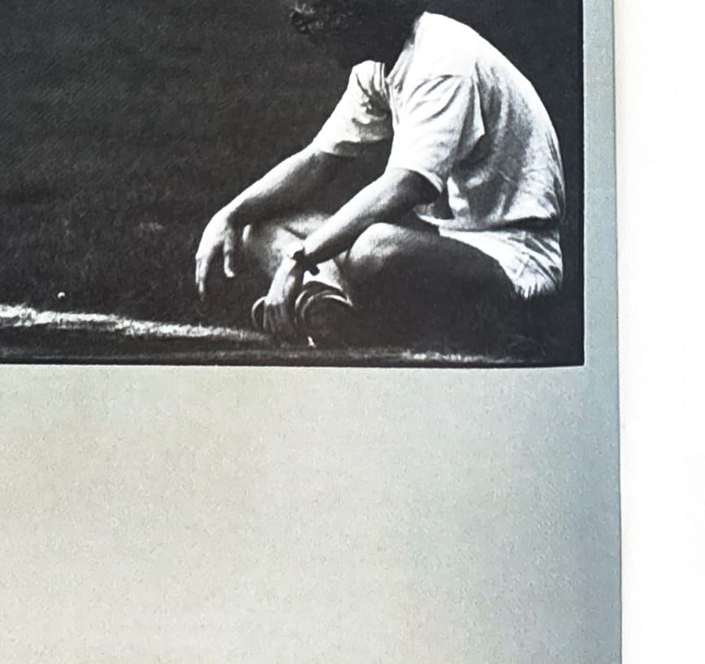

import RouteStats from "@/components/blog/RouteStats.astro";

<RouteStats
	routeNumber={frontmatter.routeNumber}
	section={frontmatter.section}
	distanceMiles={frontmatter.distanceMiles}
	distanceKm={frontmatter.distanceKm}
	difficulty={frontmatter.difficulty}
	beginningPoint={frontmatter.beginningPoint}
	runningSurface={frontmatter.runningSurface}
	suggestedBy={frontmatter.suggestedBy}
	conditions={frontmatter.routeConditions}
/>

<blockquote>

Here's another outstanding scenic route in a beautiful rustic setting. It is uncrowded and relatively unknown to most Portlanders with the exception of the Oregon Road Runners Club which sponsors two major runs a year there.

To get to Hagg Lake, take the Tualatin Valley Highway west of Portland through Hillsboro and Forest Grove. Stay on Highway 47 and take the right turn to Scoggins Valley Road crossing the dam to the parking lot.

Start the run by heading clockwise around the south end of the lake, taking it slow and easy and saving your energy for the hills on the other side. There are plenty of ups and downs as you can see from the course profile. The last hill is the highest, followed by a long, blissful descent down to the dam, where you turn right and run a flat half mile back to the parking lot.

On warm days, you may want to reward yourself with a dip in the cool water of the lake. There are picnic tables, so bring the family and make a day of it. Restrooms are available, but bring your own drinking water.

</blockquote>

_Course map and elevation profile from the original book._

_Photograph by Ancil Nance, from the original book._

