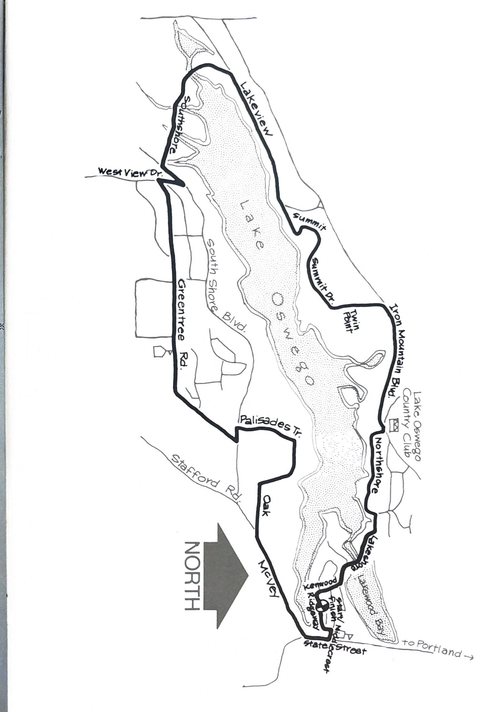
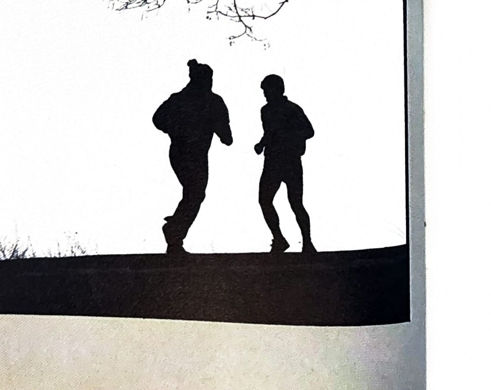

import RouteStats from "@/components/blog/RouteStats.astro";

<RouteStats
	routeNumber={frontmatter.routeNumber}
	section={frontmatter.section}
	distanceMiles={frontmatter.distanceMiles}
	distanceKm={frontmatter.distanceKm}
	difficulty={frontmatter.difficulty}
	beginningPoint={frontmatter.beginningPoint}
	runningSurface={frontmatter.runningSurface}
	suggestedBy={frontmatter.suggestedBy}
	conditions={frontmatter.routeConditions}
/>

<blockquote>

This loop is another popular run with Oswego-area runners and is the course for the city's Parks Department annual August running event.

To get to the Swim Park follow Macadam Avenue 8 miles south of Portland on the west side of the Willamette River. Turn right at Ridgeway off State Street (Portland/Lake Oswego/West Linn Highway). Park at the intersection of Ridgeway and Lakewood by the park. Go either way you want, but we recommend starting around the south end and climbing the major hills first, leaving the easier going for the home stretch.

On the north side of the lake, don't miss the right turn off Iron Mountain Road onto Northshore to avoid ending up at the other end of town. The only drawback is traffic on some of the narrow roads so be alert, especially on the windy north side.

The loop combines rustic views of the lake and surrounding hills, wooded stretches and some of the most beautiful residential areas in the state. Be prepared for narrow, winding lanes, small bridges over streams and canals, enchanting glimpses of beautifully landscaped lawns, rock walls and tudor architechture all reminiscent of European cities.

After the run, weather providing, stay for a swim at the fine park. Facilities available there. No water available on the way.

</blockquote>

_Course map from the original book._

_Photograph by Ancil Nance, from the original book._

