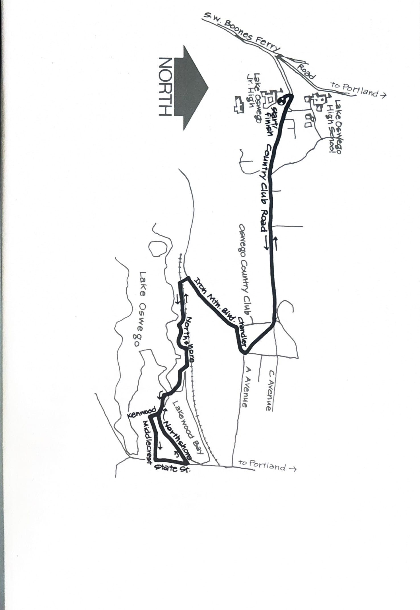
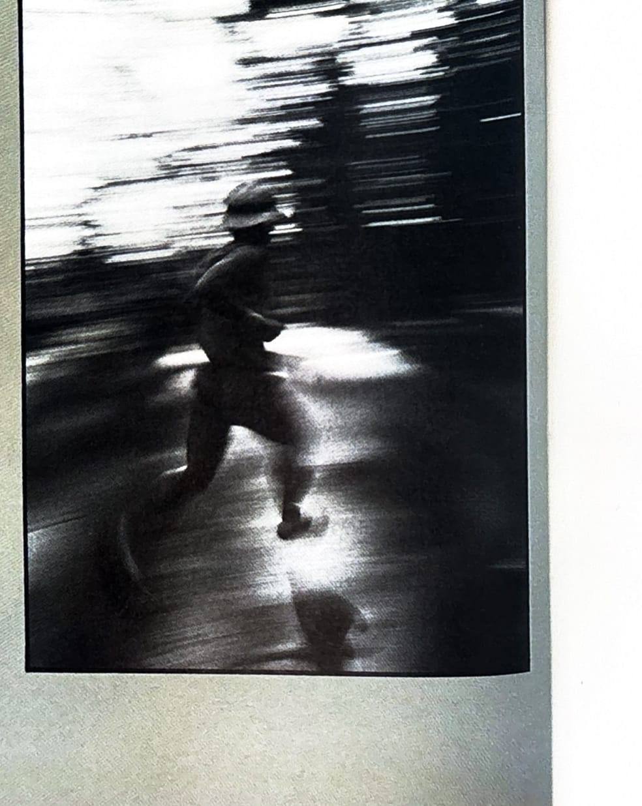

import RouteStats from "@/components/blog/RouteStats.astro";

<RouteStats
	routeNumber={frontmatter.routeNumber}
	section={frontmatter.section}
	distanceMiles={frontmatter.distanceMiles}
	distanceKm={frontmatter.distanceKm}
	difficulty={frontmatter.difficulty}
	beginningPoint={frontmatter.beginningPoint}
	runningSurface={frontmatter.runningSurface}
	suggestedBy={frontmatter.suggestedBy}
	conditions={frontmatter.routeConditions}
/>

<blockquote>

The Lake Oswego area is a runners paradise, with its seemingly endless miles of rustic roads and charming country lanes bordering the lake. This course, which includes portions of the north side of the lake, is the scene of the annual Olympic Fund Run and includes a fine sampling of this area without many hills.

If you are approaching the start from Portland via the Macadam-State Street route, turn right at "A" Street (stop light) and follow it up through town as it jogs right and becomes Country Club Road. Stay on Country Club Road until you come to the Junior High on your left.

Park in the lot and run back down Country Club, all the way to the intersection with "A" Street, bearing right there down Chandler to Iron Mountain Road. There's just a short jog along State Street before you go left on Northshore and retrace your steps.

</blockquote>

_Course map from the original book._

_Photograph by Ancil Nance, from the original book._

