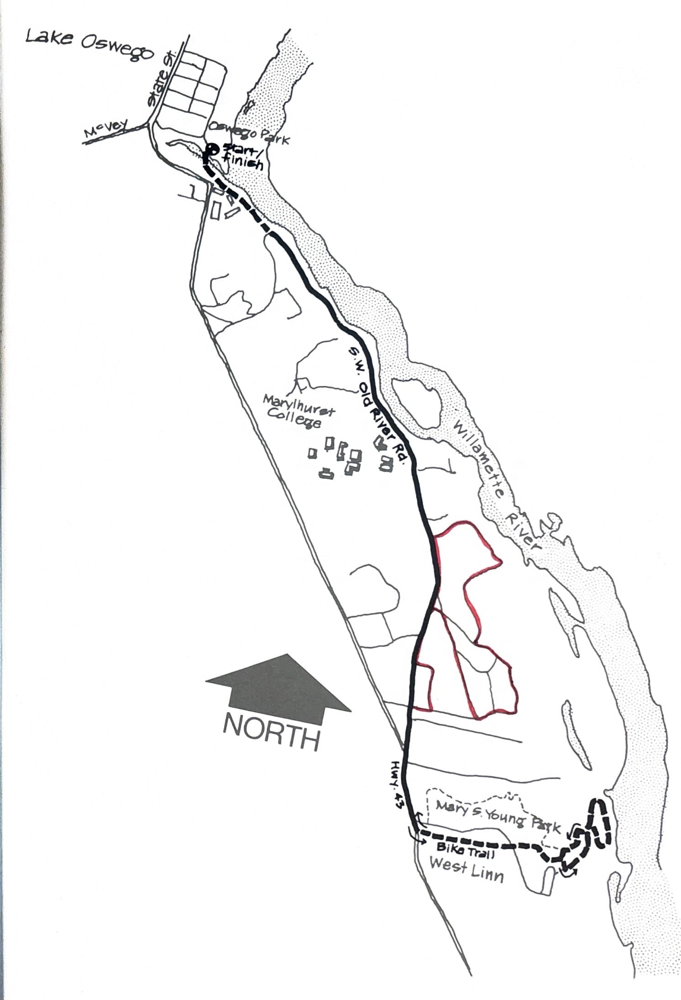

import RouteStats from "@/components/blog/RouteStats.astro";

<RouteStats
	routeNumber={frontmatter.routeNumber}
	section={frontmatter.section}
	distanceMiles={frontmatter.distanceMiles}
	distanceKm={frontmatter.distanceKm}
	difficulty={frontmatter.difficulty}
	beginningPoint={frontmatter.beginningPoint}
	runningSurface={frontmatter.runningSurface}
	suggestedBy={frontmatter.suggestedBy}
	conditions={frontmatter.routeConditions}
/>

<blockquote>

If you've been looking for a run along the Willamette in a rustic setting, this is for you. This run links up two of the few publicly available forested trails along the Willamette in the Portland area. Although it is not a loop, the rewards are well worth the up and back.

Drive through the center of Lake Oswego on State Street and take a left just beyond the playfield. Drive to the end of the road in the parking lot by the huge old stone smelting furnace. There's a water fountain by the furnace.

The run starts at the footbridge at the south end of the parking lot. Stay left over the bridge on a dirt path just a few yards above the river. Some 500 yards on, the trail runs into Old River Road on the other side of another footbridge.

Follow Old River Road as it winds for two miles along the river and up through the wooded suburbs of West Linn. Several BIKE PATH signs will keep you from getting lost. The road ends at the Oswego-West Linn Highway. Stay on the paved bike path on the east side of the highway and run south about 1/4 mile to the entrance of Mary S. Young State Park. Cross the driveway and stay on the bike path some 50 ft. beyond.

This will take you into the park where there are restrooms and water. Stay right at the first fork of the path in the park and follow the sign saying RIVER VIEWPOINT. As you descend the hill, take the small circle on your right to the viewpoint. Coming out on the main trail again, continue downhill to a fork. Either path will take you down to a grassy meadow at the edge of the Willamette River. Cross the meadow and use the other path to return to the main trail. Just beyond the fork on the right is a dam and a sign pointing to the Perimeter Hiking Trail. Take this trail back up the hill via wooden bridges, stairs and dirt trail. This will take you back to the picnic area and parking lot in Mary S. Young Park where you came in.

Now, retrace your footsteps back down Old River Road to George Rogers Park.

</blockquote>

_Course map from the original book._

