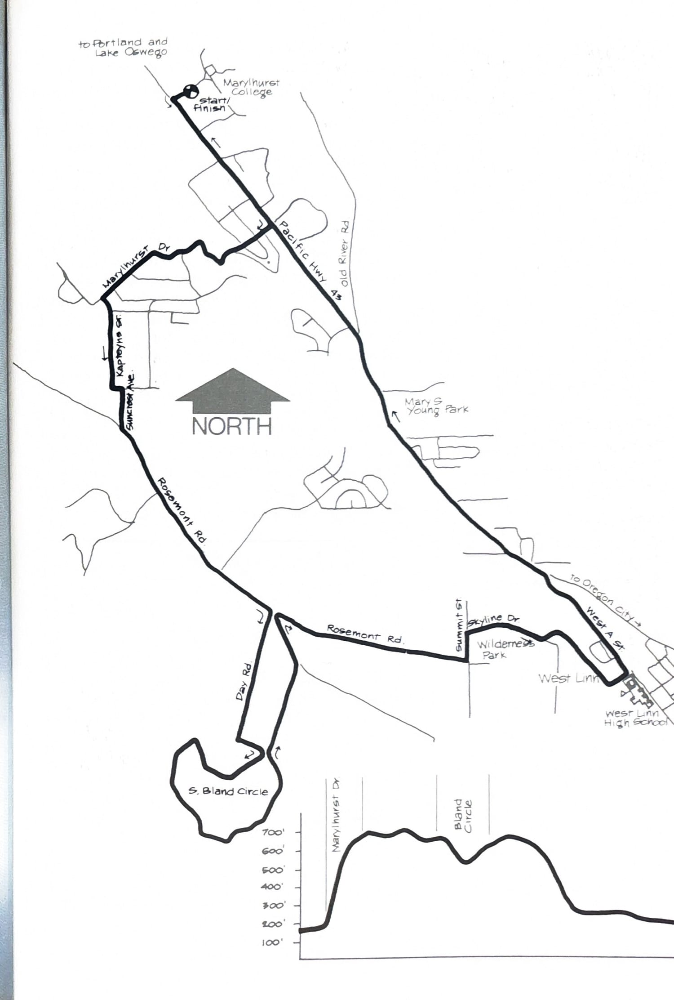

import RouteStats from "@/components/blog/RouteStats.astro";

<RouteStats
	routeNumber={frontmatter.routeNumber}
	section={frontmatter.section}
	distanceMiles={frontmatter.distanceMiles}
	distanceKm={frontmatter.distanceKm}
	difficulty={frontmatter.difficulty}
	beginningPoint={frontmatter.beginningPoint}
	runningSurface={frontmatter.runningSurface}
	suggestedBy={frontmatter.suggestedBy}
	conditions={frontmatter.routeConditions}
/>

<blockquote>

Any book of running routes needs at least one fanny buster, and this is it! The first half mile up hill on Marylhurst Drive is a killer - you'll understand why it's been given that name. Having said that, once you're on top, you'll be rewarded with a tour of beautiful rural country and continuous panoramic vistas in all directions.

Driving south from Lake Oswego, take the second Marylhurst Education Center driveway and park in the lot by St. Anne's Chapel. The course begins at the edge of that lot by the driveway.

Turn left on the highway and run south on the bike trail about 1/2 mile to Marylhurst Drive at the light. Cross, and begin the long haul up the hill. Stay on Marylhurst all the way to Valleyview, where you turn left. Bear right on Kapteyns and follow it to the turn-around. Take the emergency road from there leading some 100 yards downhill to Suncrest Avenue (unmarked) and turn right. Follow Suncrest to Rosemont Road and turn left.

A mile down the road, take a sharp right at the five-way intersection, and run up the hill past the Charolais cattle. You'll be doing a circle of Day and Bland roads before coming back to this same intersection and turning sharp right (east) on Rosemont. A long gentle decline will bring you to Summit where you'll turn left and plunge down the steep hill. Summit turns into Skyline at the first bend to the right, and you'll follow Skyline down past the Wilderness Park to the high school on "A" Street. Turn left there and follow "A" north as it runs into the highway which will lead you back to your car.

The only water and facilities are along the highway.

</blockquote>

_Course map and elevation profile from the original book._

