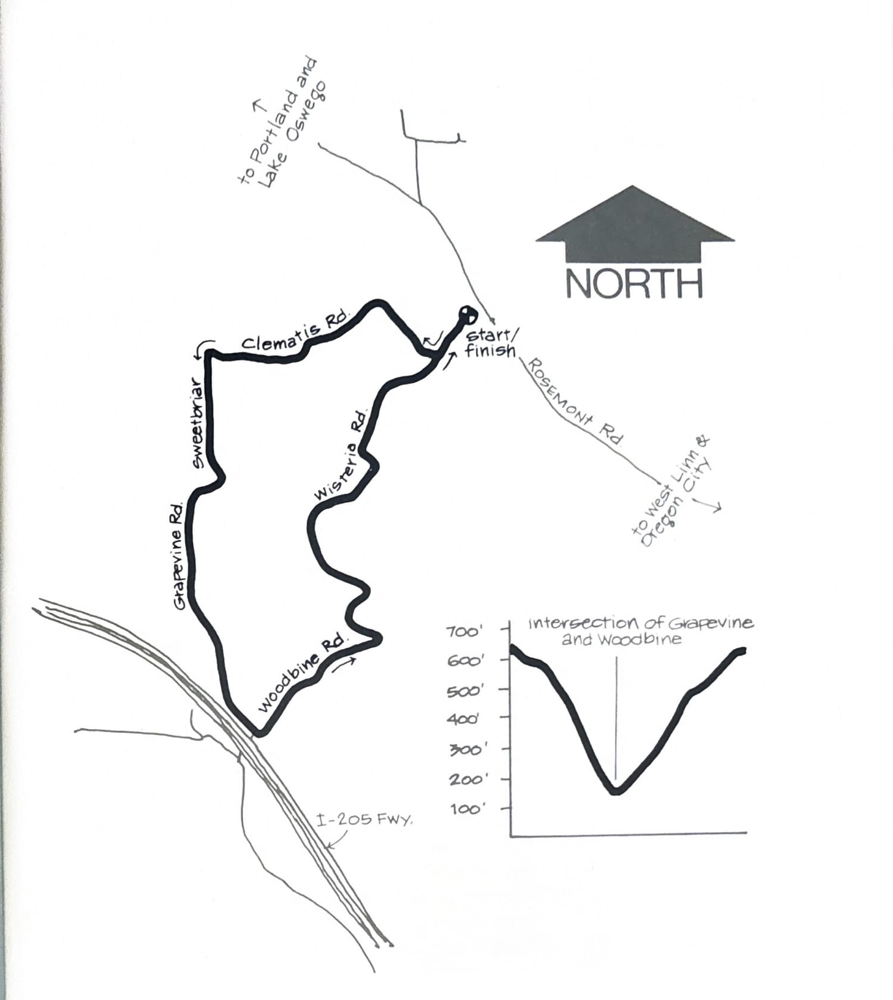
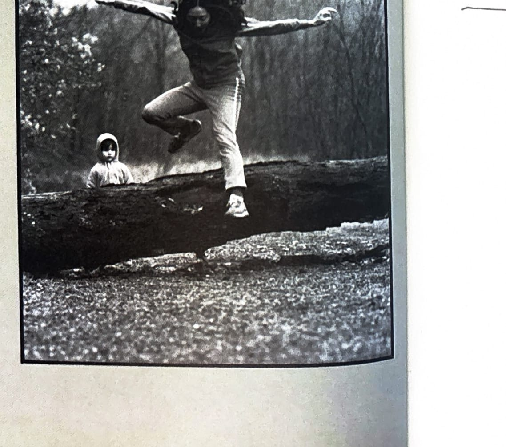

import RouteStats from "@/components/blog/RouteStats.astro";

<RouteStats
	routeNumber={frontmatter.routeNumber}
	section={frontmatter.section}
	distanceMiles={frontmatter.distanceMiles}
	distanceKm={frontmatter.distanceKm}
	difficulty={frontmatter.difficulty}
	beginningPoint={frontmatter.beginningPoint}
	runningSurface={frontmatter.runningSurface}
	suggestedBy={frontmatter.suggestedBy}
	conditions={frontmatter.routeConditions}
/>

<blockquote>

This is a lovely loop along shady country lanes, with grazing animals and secluded rural homes backdropped by fine views of the Tualatin Valley country.

To get to the Rosemont/Wisteria intersection, follow the directions in the Killer Kowalski run up Marylhurst Drive to Valleyview. Go left to Suncrest Avenue, then right, and you'll come out on Rosemont. Turn left and you'll come to Wisteria about 500 yds. east.

If you want to start by running downhill and finish running uphill, park on the shoulder along Wisteria just below the STOP sign. You'll take a right at Clematis Road and follow that dirt road to Sweetbriar and turn left. At the next intersection, keep bearing right and the road turns into Grapevine. Now you'll be paralleling the Tualatin River (below on your right) as you descend to the valley floor at the Woodbine intersection before turning left and heading back up to your car.

An alternative parking place is at the intersection of Woodbine and Grapevine Roads by the freeway. In that case, you start uphill and finish downhill.

</blockquote>

_Course map and elevation profile from the original book._

_Photograph by Ancil Nance, from the original book._

