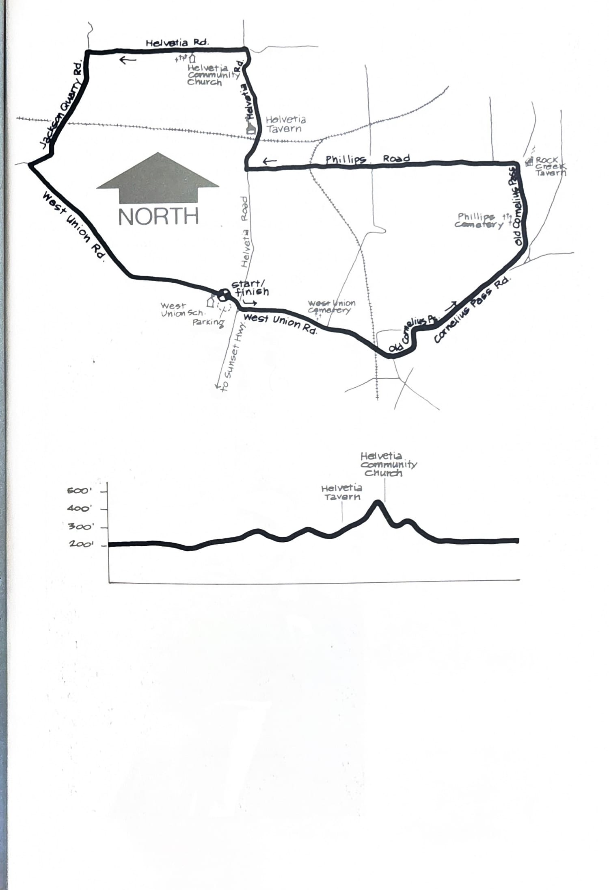

import RouteStats from "@/components/blog/RouteStats.astro";

<RouteStats
	routeNumber={frontmatter.routeNumber}
	section={frontmatter.section}
	distanceMiles={frontmatter.distanceMiles}
	distanceKm={frontmatter.distanceKm}
	difficulty={frontmatter.difficulty}
	beginningPoint={frontmatter.beginningPoint}
	runningSurface={frontmatter.runningSurface}
	suggestedBy={frontmatter.suggestedBy}
	conditions={frontmatter.routeConditions}
/>

<blockquote>

This run combines pioneer churches and cemeteries with railroad trestles, beautiful farm land and two of the earthiest taverns in the Portland area.

Drive west on Sunset Highway about 15 miles from downtown Portland to the Helvetia exit. Turn right and follow Helvetia Road about 3/4 mile to West Union Road. Go left, and park about 100 yards up the road at the West Union Grade School.

Leaving the parking lot, run east on West Union Road passing the West Union Baptist Church and cemetery at about 1 mile. The church was built in 1853 and is the oldest Baptist church west of the Rocky Mountains. Continue on about 1/2 mile and turn left on Old Cornelius Pass Road. Descend gently through trees and rural houses, coming out on Cornelius Pass Road. Turn left and follow this highway for about a mile, going left where it rejoins Old Cornelius Pass Road.

On your left you'll pass the Phillips Cemetery, the second of three pioneer cemeteries along the route. At about the 4 mile point you'll come to Phillips Road with the Rock Creek Tavern on your right overlooking a lovely farming valley. Turn left on Phillips past a deserted red school house on the right, and continue up this country lane under the railroad trestle to the Helvetia Road intersection at about 6 miles.

Turn right on Helvetia Road and run through the charming community of Helvetia with the tavern on your left. Stay on the left of the road as you'll have some sharp turns ahead. You'll encounter hills along this stretch of Helvetia Road, each offering wide vistas of the surrounding country side. Over the crest of the last hill is the Helvetia Community Church built in 1899 and sporting a 65 foot spire. Go left at Jackson Quarry Road to West Union Road and left again through spacious open country back to the school. No restrooms or water are available on the route except at the two taverns.

</blockquote>

_Course map and elevation profile from the original book._

