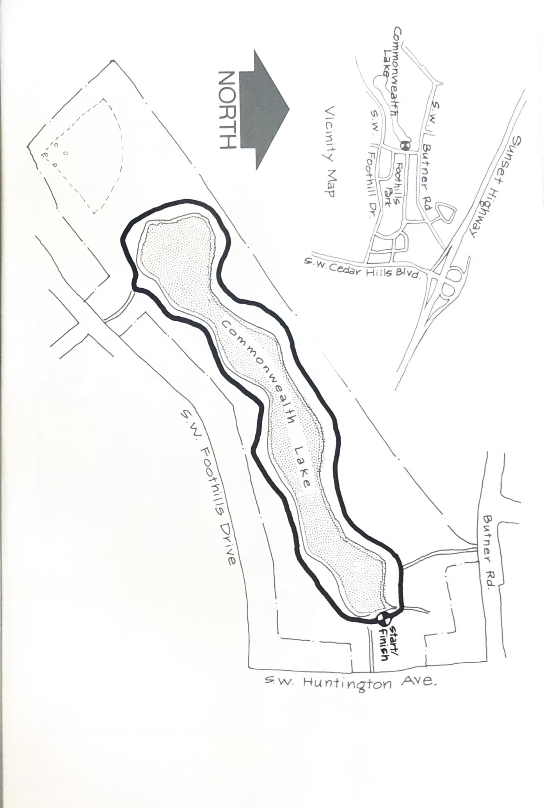
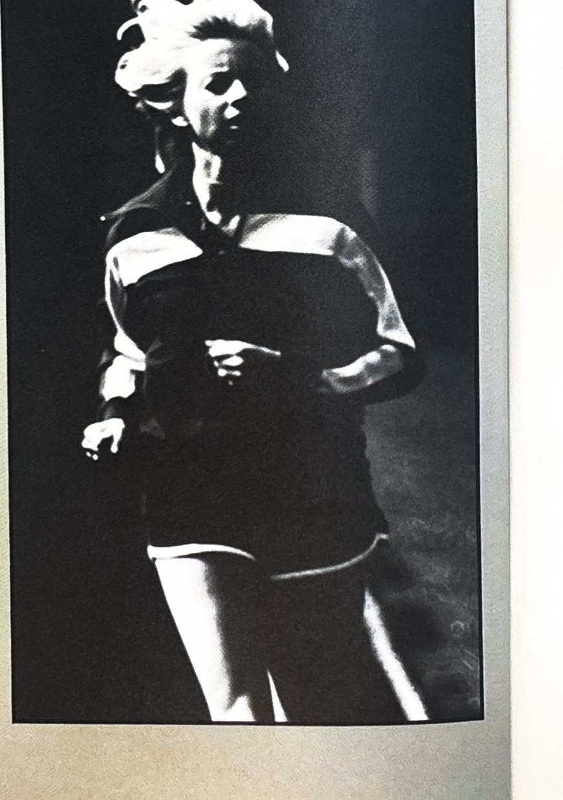

import RouteStats from "@/components/blog/RouteStats.astro";

<RouteStats
	routeNumber={frontmatter.routeNumber}
	section={frontmatter.section}
	distanceMiles={frontmatter.distanceMiles}
	distanceKm={frontmatter.distanceKm}
	difficulty={frontmatter.difficulty}
	beginningPoint={frontmatter.beginningPoint}
	runningSurface={frontmatter.runningSurface}
	suggestedBy={frontmatter.suggestedBy}
	conditions={frontmatter.routeConditions}
/>

<blockquote>

This is short but sweet. It offers a good chance to combine a run with a family outing.

To get to this pretty little park tucked away in Cedar Hills, drive out Sunset Highway west and turn off at the Cedar Hills Boulevard exit. Follow the road around and under the highway and head south on Cedar Hills Blvd. Turn right at the second corner on S.W. Foothills Drive and follow it right into the park. Park on the street and walk a hundred yards or so down the paved path to the east end of the lake.

The trail circles the lake. Go around as many times as you want and enjoy this unusually tranquil oasis in bustling west side suburbia.

</blockquote>

_Course map from the original book._

_Photograph by Ancil Nance, from the original book._

