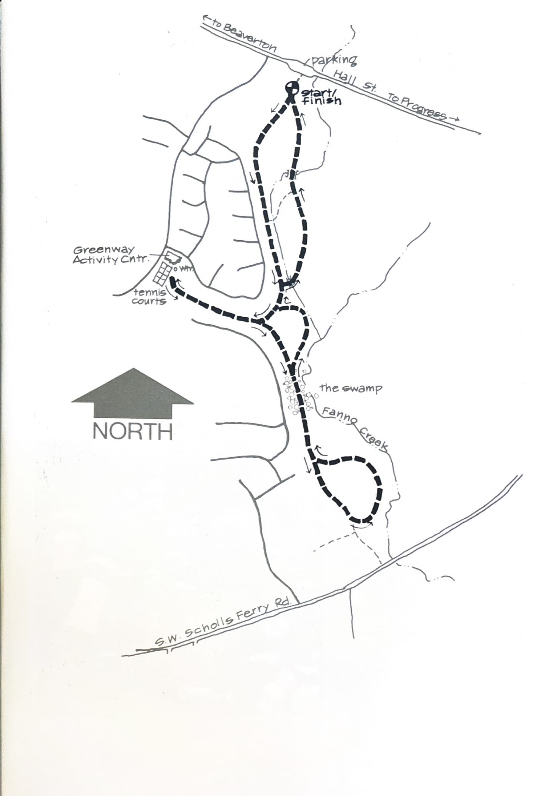
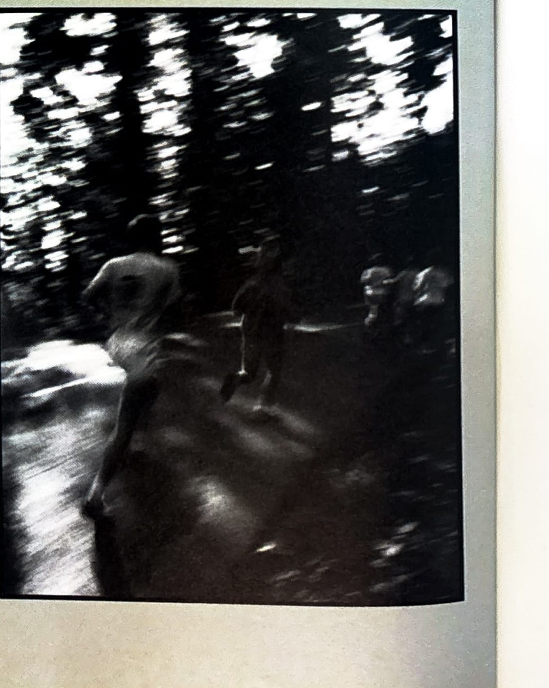

import RouteStats from "@/components/blog/RouteStats.astro";

<RouteStats
	routeNumber={frontmatter.routeNumber}
	section={frontmatter.section}
	distanceMiles={frontmatter.distanceMiles}
	distanceKm={frontmatter.distanceKm}
	difficulty={frontmatter.difficulty}
	beginningPoint={frontmatter.beginningPoint}
	runningSurface={frontmatter.runningSurface}
	suggestedBy={frontmatter.suggestedBy}
	conditions={frontmatter.routeConditions}
/>

<blockquote>

Greenway Park, operated by the Tualatin Hills Parks and Recreation District, is a favorite noon-hour jogging area for many employees of the industrial park located right down the road. Take Highway 217 heading south to the Progress exit. Turn right, or west on Hall Street and park where the road widens by the Greenway Park sign on your left.

There are arrows painted on the paths, but to avoid getting confused, ignore them and follow our map to get the full 2.6 miles. Take the dog leg to the right and circle the tennis courts before coming back the same way. The trail goes through a marsh area that can be inundated with as much as 8 inches of water during rainy months, but you can pick your way around it.

Future plans call for extension of this fine park and trail system north and south along Fanno Creek. There are no water fountains or restrooms as yet.

</blockquote>

_Course map from the original book._

_Photograph by Ancil Nance, from the original book._

