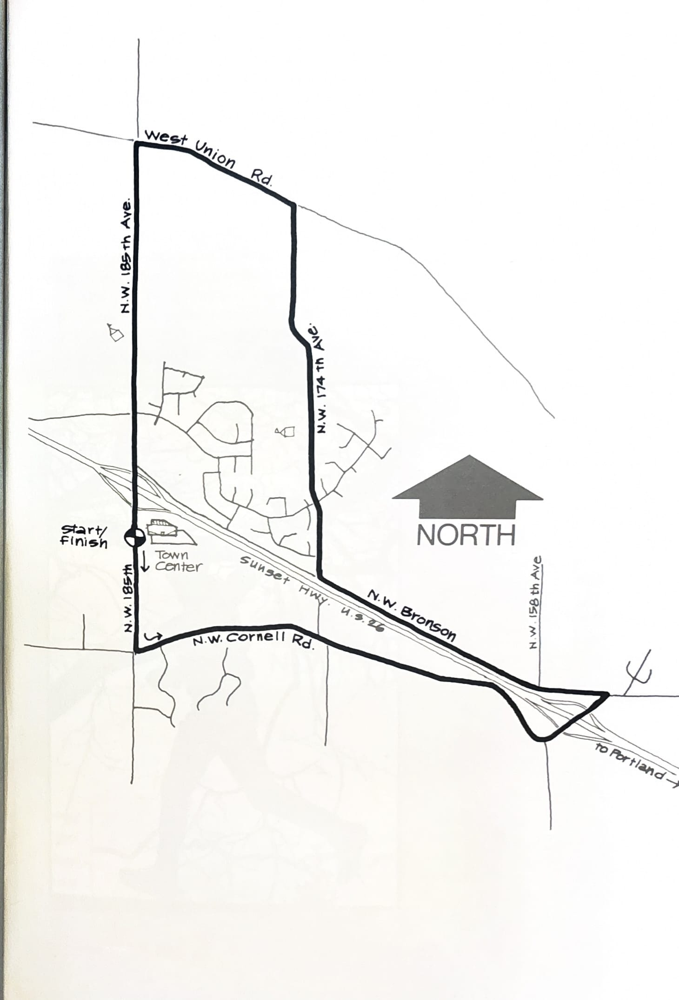
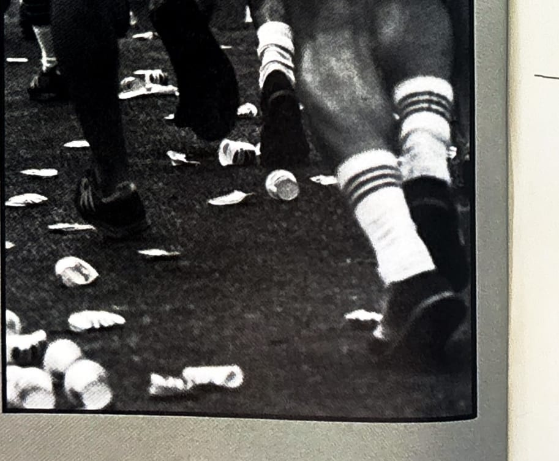

import RouteStats from "@/components/blog/RouteStats.astro";

<RouteStats
	routeNumber={frontmatter.routeNumber}
	section={frontmatter.section}
	distanceMiles={frontmatter.distanceMiles}
	distanceKm={frontmatter.distanceKm}
	difficulty={frontmatter.difficulty}
	beginningPoint={frontmatter.beginningPoint}
	runningSurface={frontmatter.runningSurface}
	suggestedBy={frontmatter.suggestedBy}
	conditions={frontmatter.routeConditions}
/>

<blockquote>

This run will take you through some beautiful rural countryside that is all too soon becoming urbanized. Enjoy it while you can. The course straddles Sunset Highway. Elevation changes are slight and gradual.

Drive out Sunset Highway 10 miles west of Portland. Look for the huge Somerset West development on your right and turn off at the 185th exit. Turn left at 185th, cross the overpass and park in the Town Center parking lot on 185th.

Start running south on 185th to Cornell, following the map. Turn left on Cornell and parallel Sunset Highway for a short distance over rolling hills. Cross Sunset Highway and bear immediately left on Bronson. There's no sign indicating 174th, so watch on your left for the big green sign saying ALOHA-BETHANY NEXT RIGHT, and turn right at the street opposite the sign. Road shoulders are narrow in some places so you might have to change sides on occasion. After left turns at West Union Road and 185th, you will be headed back toward the Town Center.

The only facilities are at service stations near the 185th freeway exit.

</blockquote>

_Course map from the original book._

_Photograph by Ancil Nance, from the original book._

