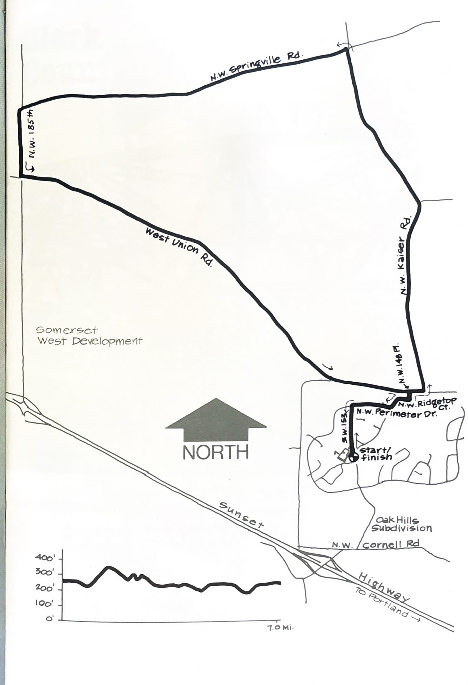
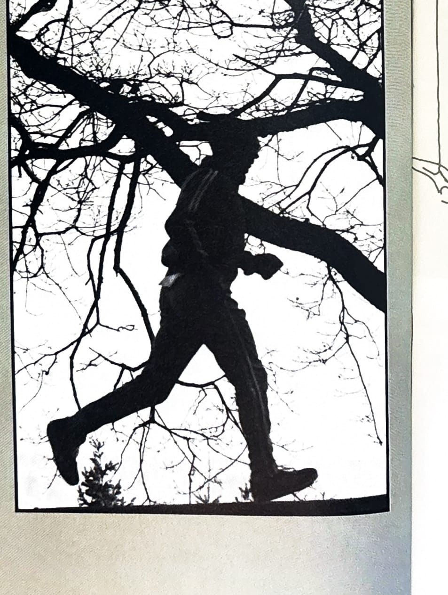

import RouteStats from "@/components/blog/RouteStats.astro";

<RouteStats
	routeNumber={frontmatter.routeNumber}
	section={frontmatter.section}
	distanceMiles={frontmatter.distanceMiles}
	distanceKm={frontmatter.distanceKm}
	difficulty={frontmatter.difficulty}
	beginningPoint={frontmatter.beginningPoint}
	runningSurface={frontmatter.runningSurface}
	suggestedBy={frontmatter.suggestedBy}
	conditions={frontmatter.routeConditions}
/>

<blockquote>

This beautiful Tualatin Valley loop, the setting for two annual ORRC runs, is a long time favorite of runners in the area and attracts many Portlanders who come out for a weekend outing. There are many fine vistas of the rolling West Union/Helvetia area farmlands.

Drive out Sunset Highway to the Cornell Road Exit. Turn right on Cornell, then left into the Oak Hills subdivision. Follow the road past the portals at the entrance and park at the school.

Start running north on 153rd and follow the map out the north side of the subdivision onto Kaiser Road, and you're in the country. Bring your own water; there are no restrooms. Try this charming loop at different times of the year -- it's an ever-changing delight.

</blockquote>

_Course map and elevation profile from the original book._

_Photograph by Ancil Nance, from the original book._

