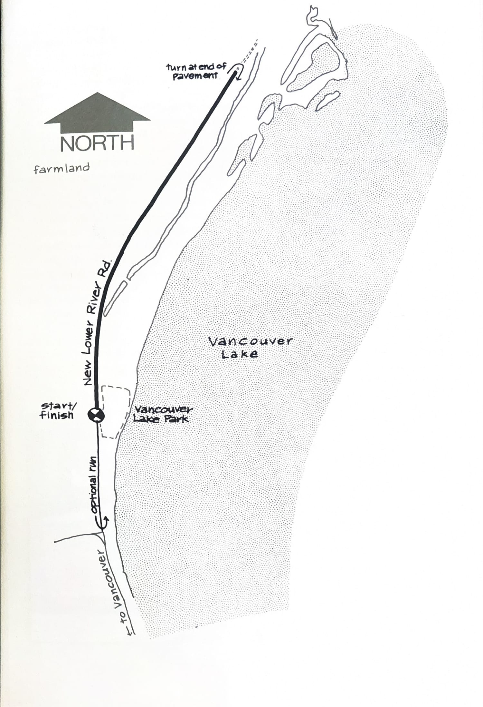
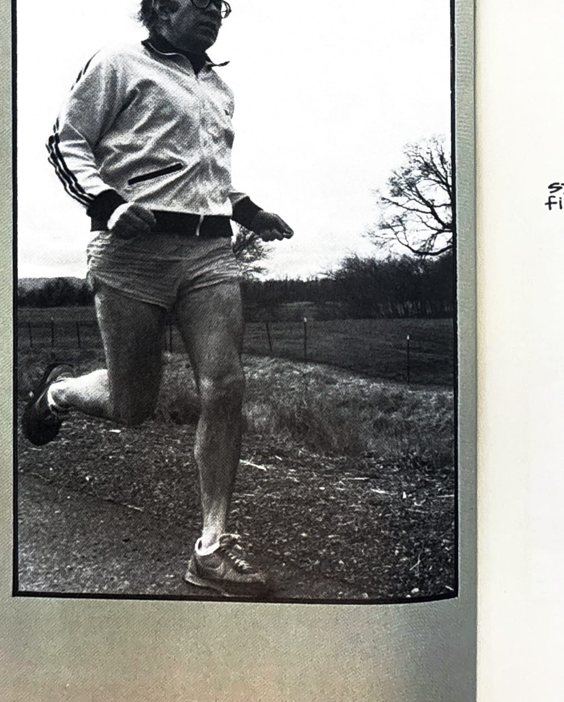

import RouteStats from "@/components/blog/RouteStats.astro";

<RouteStats
	routeNumber={frontmatter.routeNumber}
	section={frontmatter.section}
	distanceMiles={frontmatter.distanceMiles}
	distanceKm={frontmatter.distanceKm}
	difficulty={frontmatter.difficulty}
	beginningPoint={frontmatter.beginningPoint}
	runningSurface={frontmatter.runningSurface}
	suggestedBy={frontmatter.suggestedBy}
	conditions={frontmatter.routeConditions}
/>

<blockquote>

Few Portlanders have ever seen Vancouver Lake -- a huge body of water lying only a few minutes from downtown Vancouver, yet curiously desolate in a way you can only appreciate by going there. This is a fine run if you're hunting for a rural stretch that is quiet, relatively scenic and flat as a pancake.

To get there, take the Fourth Plain Exit off I-5 in Vancouver and cross back over the freeway, bearing right in a few blocks to 26th. Drive west on 26th as it turns into Lower River Road and follow the BIKE PATH signs to Vancouver Lake Park. The park has restrooms, water and a phone.

Run north to the end of the pavement and turn around there. For an additional option upon returning to the park, continue on south to the "T" intersection and come back, adding another .6 mi (1km.).

</blockquote>

_Course map from the original book._

_Photograph by Ancil Nance, from the original book._

