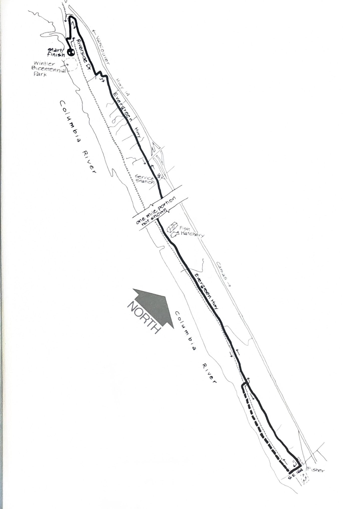
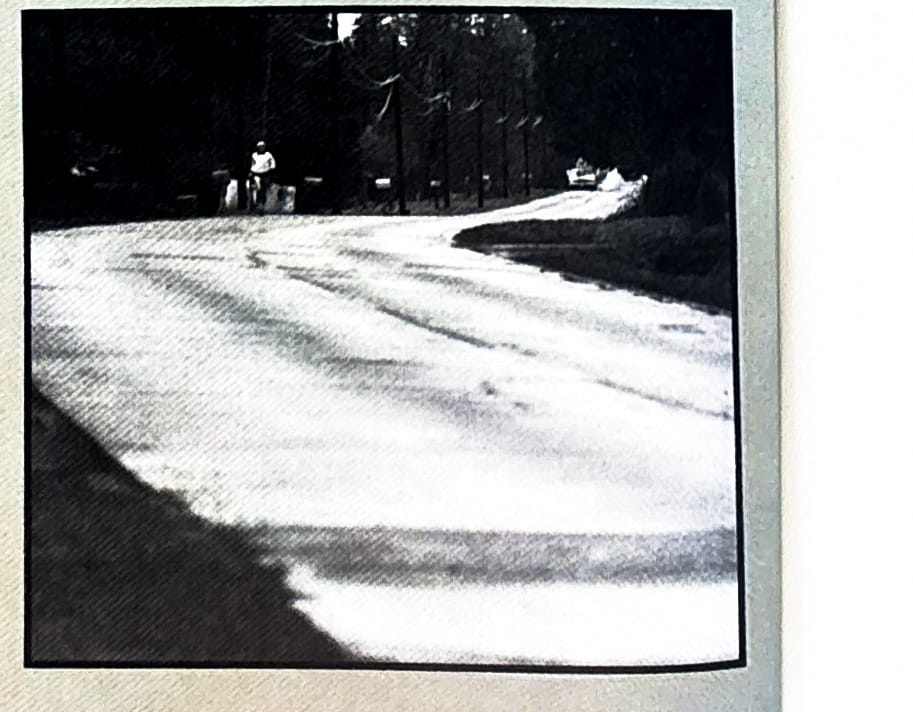

import RouteStats from "@/components/blog/RouteStats.astro";

<RouteStats
	routeNumber={frontmatter.routeNumber}
	section={frontmatter.section}
	distanceMiles={frontmatter.distanceMiles}
	distanceKm={frontmatter.distanceKm}
	difficulty={frontmatter.difficulty}
	beginningPoint={frontmatter.beginningPoint}
	runningSurface={frontmatter.runningSurface}
	suggestedBy={frontmatter.suggestedBy}
	conditions={frontmatter.routeConditions}
/>

<blockquote>

A year or so ago the ORRC publication, "The Oregon Distant Runner", invited readers to write in their descriptions of a favorite run. A Vancouver runner, Wes Christenson, was so ecstatic over this route that he devoted a 20 stanza epic poem to praising its virtues. This run -- away from the tumult of the city -- is undoubtedly the finest Columbia river course in the metro area.

Cross the Interstate Bridge, follow the signs to Camas and you're on Highway 14. Travel about three miles, turn off at the Evergreen Boulevard/Riverside Drive Exit, and follow the signs to Wintler Bicentennial Park.

The hard part is first, so start out running back up the hill the way you came, going right at the stop sign (following the BIKE ROUTE signs) to Riverside Drive. Run a half mile more to Chelsea Street, up the hill, and right to the Evergreen Highway. Now, shift into "automatic pilot" and remember everything you've read abouth metaphysical benefits of running. Coast along the flats and enjoy the Columbia, the wind, Mt. Hood and more.

Following the map, go up the highway, turn right at 164th, and come back along the railroad tracks. Water and restrooms are available at the Texaco Station.

</blockquote>

_Course map from the original book._

_Photograph by Ancil Nance, from the original book._

