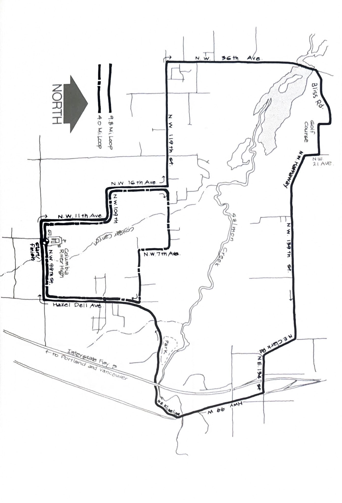

import RouteStats from "@/components/blog/RouteStats.astro";

<RouteStats
	routeNumber={frontmatter.routeNumber}
	section={frontmatter.section}
	distanceLabel={frontmatter.distanceLabel}
	beginningPoint={frontmatter.beginningPoint}
	runningSurface={frontmatter.runningSurface}
	suggestedBy={frontmatter.suggestedBy}
	conditions={frontmatter.routeConditions}
/>

<blockquote>

The longer of these two loops must certainly be in contention for one of the prettiest running routes in Clark County, and both have been used in Clark County Track Club events. There's something for everyone - residential neighborhoods, open farm land, rustic countryside, a county park, golf course, and, along the longer loop, fine view points of Salmon Creek canyon with its scenic bottomlands.

The easiest way to get there is to take I-5 north of Vancouver to the 78th Street exit. Go left over the freeway on 78th to 9th Ave. and right on 9th to the high school parking lot.

The run begins going west on 9th from the school, turning right on 11th. Follow 11th through the residential area as it breaks out into trees and fields. Both loops, short and long, get the experience of descending into canyons and climbing the other side. For the shorter loop, turn right at 119th, beginning your descent shortly thereafter into Couger Canyon.

If you're really feeling your oats, turn left on 119th and stretch your legs and lungs on the longer loop. On N.W. 36th you pass through the charming unincorporated community of Felida with lovely views to the west of farmland and rolling hills. Shortly you'll begin your descent into the beautiful river bottoms and marsh area of Salmon Creek. Climbing up the other side, make sure you don't miss the first road (Bliss) angling up right along the canyon. After the sharp climb up Bliss, the run to 99W is fairly level.

As you're heading south on Hwy. 99W, take the first small road bearing right just after the bridge as you're liable to miss the sign (Klineline).

Facilities are in short supply, but there are stores and service stations on Hwy. 99W if needed.

</blockquote>

_Course map from the original book._

