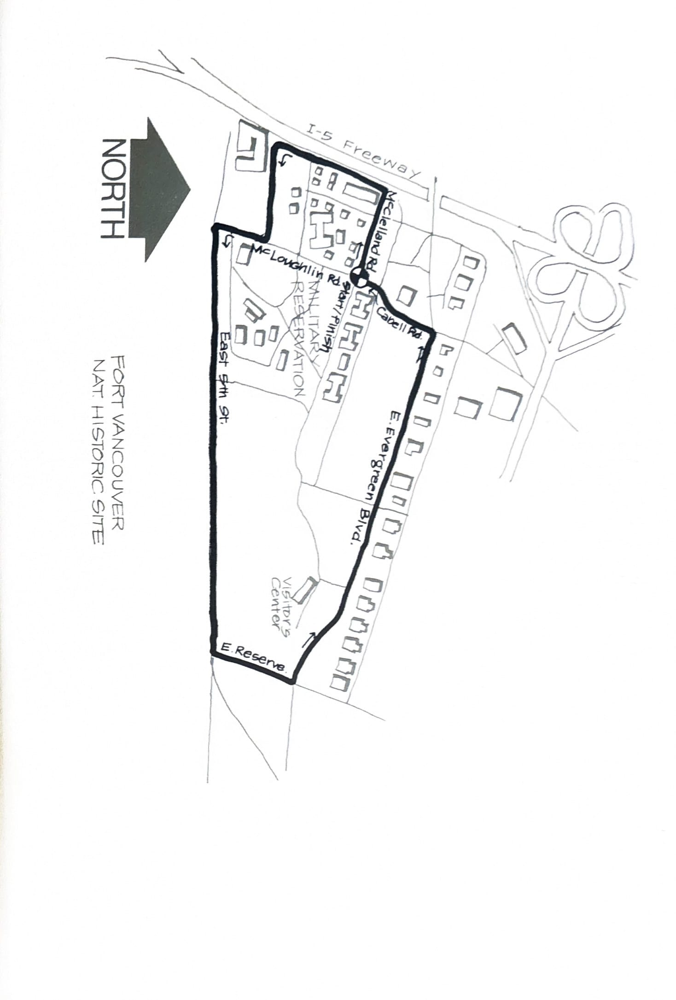
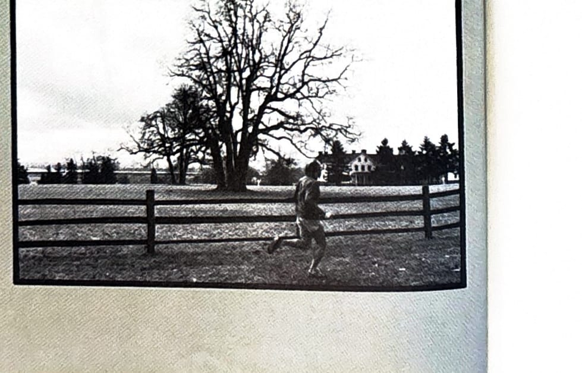

import RouteStats from "@/components/blog/RouteStats.astro";

<RouteStats
	routeNumber={frontmatter.routeNumber}
	section={frontmatter.section}
	distanceMiles={frontmatter.distanceMiles}
	distanceKm={frontmatter.distanceKm}
	difficulty={frontmatter.difficulty}
	beginningPoint={frontmatter.beginningPoint}
	runningSurface={frontmatter.runningSurface}
	suggestedBy={frontmatter.suggestedBy}
	conditions={frontmatter.routeConditions}
/>

<blockquote>

Want a short jaunt in an area steeped in historic lore and featuring many pre-1900 homes and buildings plus an authentic old fort? If this interests you, load everyone in the car and take I-5 over the Interstate Bridge and turn at the "Fort Vancouver National Historic Site" exit. Follow Mill Plane to Fort Vancouver Way, turn right, and drive 3 blocks south into the Barracks area. Parking is in the big lot across from the Armed Forces Lounge.

The run begins in the southeast corner of the parking lot, at the intersection of McClellan and McLoughlin. Start running west on McClellan toward the freeway. Run to the fence along the freeway, turn left, and follow it down to where the road ends (by the yellow fire hydrant). Go left here running straight east past the brick building on your right.

Fifth Street is a broad avenue with little traffic and good running on the shoulders or grass. Soon you'll pass an authentic replica of the original Fort Vancouver. On your left, and also a part of the Fort Vancouver National Historic Site (National Park Service), is a large grassy area and the Park Visitor's Center.

Coming back along Evergreen Blvd., you'll pass many old buildings from the military reservation, most in excellent condition and occupied by private organizations. Among these is the U.S. Grant Museum.

There are facilities at the Historic Site Museum and Visitor's Center, open in season.

</blockquote>

_Course map from the original book._

_Photograph by Ancil Nance, from the original book._

