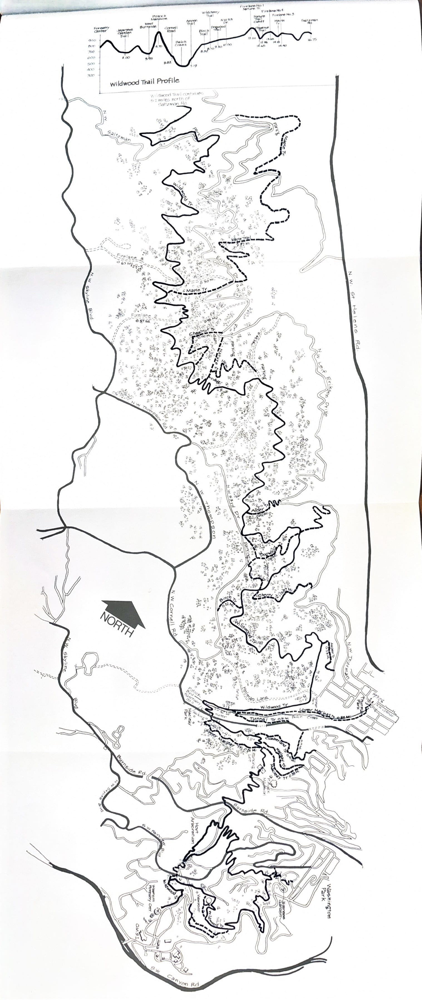

This fold-out is bound into the Near West Side section of _Running Around Portland_, between
routes 22 and 23. Unfolded, it's a single tall panel tracing the **Wildwood Trail** the length
of Forest Park — from the [Forestry Center / Hoyt Arboretum Loop](/posts/running-around-portland/21-forestry-center-hoyt-arboretum-loop/)
and [Macleay Park Loop](/posts/running-around-portland/22-macleay-park-loop/) in the south,
past the firelanes, Aspen, Birch, Maple, Chestnut, and Cherry trails, north to Saltzman Road —
along with an elevation profile of the full trail running across the top.

The [Balch Creek / N.W. Thurman Loop](/posts/running-around-portland/23-balch-creek-nw-thurman-loop/)
and the other Wildwood-adjacent routes each use only a short stretch of what's shown here; this
map is the reference for the whole trail system connecting them.

_Fold-out map from the original book._

---

_From_ Running Around Portland _by John Perry and Buzz Willits (Running Around Portland Press, 1979). Text and maps &copy; 1979 the original authors and Running Around Portland Press; reproduced here for a non-commercial fan archive._
